# 🚀 loopwho - Simplified MVP Plan (Open Source + Freemium)

## MVP Overview

**Project Type**: Open Source Privacy Dashboard + Freemium SaaS  
**Development Timeline**: 12 weeks  
**Budget**: $65,500 (67% reduction from original)  
**Architecture**: Next.js Monolith (simple and scalable)  
**Core Value**: Automated corporate privacy monitoring with background tab scanning  

---

## 🎯 **Simplified MVP Scope**

### **What We're Building (MVP Only)**
1. **Open Source Codebase**: Full GitHub repository for self-hosting
2. **Corporate Privacy Cards**: Visual dashboard with platform cards (Google, Microsoft, Facebook)
3. **Background Tab Scanning**: Automated privacy settings extraction
4. **Freemium SaaS**: 2 free cards, unlimited for $7.8/month
5. **Basic AI Insights**: Gemini-powered privacy explanations
6. **Triple-Fallback Scraping**: DOM → Firecrawl → OCR

### **What We're NOT Building (Post-MVP)**
- ❌ Historical timeline visualization
- ❌ Complex change diff analysis  
- ❌ Privacy score algorithms
- ❌ Export functionality
- ❌ Team management features
- ❌ Advanced analytics
- ❌ Multiple subscription tiers

---

## 🏗️ **Simplified Technical Architecture**

```mermaid
flowchart TB
    subgraph "Frontend (Next.js Monolith)"
        Dashboard[📊 Corporate Cards Dashboard]
        UpgradeModal[💳 Upgrade Modal]
        ExtensionConnect[🔗 Extension Connection]
    end

    subgraph "Browser Extension"
        BackgroundScan[🔍 Background Tab Scanner]
        ContentScript[📄 Content Script Injector]
        DOMScraper[🕷️ DOM Scraper]
    end

    subgraph "Backend (Next.js API Routes)"
        ServerActions[⚡ Server Actions]
        PrivacyAPI[🔐 Privacy Data API]
        UpgradeAPI[💰 Stripe Integration]
    end

    subgraph "Data Layer (Simple)"
        PostgreSQL[(🐘 PostgreSQL)]
        BlobStorage[(☁️ Cloudflare R2)]
    end

    subgraph "External Services (Minimal)"
        GeminiAPI[🧠 Gemini API]
        FirecrawlAPI[🕷️ Firecrawl API]
        StripeAPI[💳 Stripe API]
    end

    Dashboard --> UpgradeModal
    Dashboard --> ExtensionConnect
    ExtensionConnect --> BackgroundScan
    BackgroundScan --> ContentScript
    ContentScript --> DOMScraper
    DOMScraper --> ServerActions
    ServerActions --> PostgreSQL
    ServerActions --> GeminiAPI
    DOMScraper --> FirecrawlAPI
    UpgradeAPI --> StripeAPI
```



---

## 💼 **Open Source + Freemium Business Model**

### **Source-Available Strategy**
- **Full Codebase**: Available on GitHub under Business Source License (BSL)
- **Personal Use**: Free for individuals, educational, and non-commercial use
- **Commercial Restriction**: Prevents competitors from offering paid competing services
- **Self-Hosting**: Complete instructions for personal/non-commercial deployment
- **Community**: Contributors improve platform scrapers (personal use)
- **Trust Building**: Code transparency = credibility in privacy space

### **Freemium SaaS (loopwho.com)**
- **Free Tier**: 2 corporate privacy cards, manual scans
- **Pro Tier**: $7.8/month or $78/year (10% annual discount)
  - Unlimited corporate cards
  - Automated daily scans
  - Priority support

### **Revenue Projections (Conservative)**
```
Month 3:  50 paid users × $7.8 = $390/month
Month 6:  200 paid users × $7.8 = $1,560/month  
Month 12: 500 paid users × $7.8 = $3,900/month

Annual Revenue Target: $47K (covers infrastructure + part-time maintenance)
```

---

## 🎨 **Corporate Cards UI Design**

### **Dashboard Layout**
```
┌─────────────────────────────────────────┐
│  loopwho    [Settings] [Account] [Help] │
├─────────────────────────────────────────┤
│                                         │
│  Your Corporate Privacy Monitoring      │
│  ┌─────────┐ ┌─────────┐ ┌─────────┐   │
│  │ Google  │ │Microsoft│ │   Add   │   │
│  │ [Logo]  │ │ [Logo]  │ │Corporate│   │
│  │ ✅ Good │ │ ⚠️ Review│ │   [+]   │   │
│  │ 2h ago  │ │ 1d ago  │ │         │   │
│  └─────────┘ └─────────┘ └─────────┘   │
│                                         │
│  Recent Privacy Changes (2)             │
│  • Google disabled ad tracking          │
│  • Microsoft updated data sharing       │
└─────────────────────────────────────────┘
```

### **Corporate Card Components**
- **Platform Logo**: Recognizable brand identity
- **Privacy Status**: ✅ Good, ⚠️ Review, ❌ Risk
- **Last Scan Time**: "2 hours ago", "1 day ago"
- **Quick Actions**: "View Details", "Scan Now"

### **Add Corporate Flow**
1. **Free Users (0-2 cards)**: Direct platform selection
2. **Free Users (2+ cards)**: Upgrade modal appears
3. **Pro Users**: Direct platform selection

### **Upgrade Modal Design**
```
┌─────────────────────────────────────────┐
│  Upgrade to Pro                    [×]  │
├─────────────────────────────────────────┤
│                                         │
│  Monitor unlimited corporate privacy    │
│  settings for just $7.8/month          │
│                                         │
│  ✓ Unlimited corporate cards           │
│  ✓ Automated daily scans               │
│  ✓ Priority email support              │
│                                         │
│  [Monthly $7.8] [Annual $78 💰10% off] │
│                                         │
│  [Upgrade Now]     [Maybe Later]       │
└─────────────────────────────────────────┘
```

---

## 🔧 **Simplified Technical Implementation**

### **Database Schema (PostgreSQL Only)**
```sql
-- Simple user table
CREATE TABLE users (
    id UUID PRIMARY KEY DEFAULT gen_random_uuid(),
    email VARCHAR(255) UNIQUE NOT NULL,
    subscription_tier VARCHAR(20) DEFAULT 'free',
    created_at TIMESTAMP DEFAULT NOW()
);

-- Corporate privacy connections
CREATE TABLE corporate_connections (
    id UUID PRIMARY KEY DEFAULT gen_random_uuid(),
    user_id UUID REFERENCES users(id),
    platform VARCHAR(50) NOT NULL, -- 'google', 'microsoft', 'facebook'
    status VARCHAR(20) DEFAULT 'connected',
    last_scan_at TIMESTAMP,
    privacy_data JSONB,
    created_at TIMESTAMP DEFAULT NOW()
);

-- Simple scan results (no complex versioning)
CREATE TABLE scan_results (
    id UUID PRIMARY KEY DEFAULT gen_random_uuid(),
    connection_id UUID REFERENCES corporate_connections(id),
    scan_method VARCHAR(20), -- 'dom', 'firecrawl', 'ocr'
    privacy_settings JSONB NOT NULL,
    ai_summary TEXT,
    created_at TIMESTAMP DEFAULT NOW()
);
```

### **Browser Extension (Manifest v3)**
```javascript
// Background service worker
chrome.runtime.onMessage.addListener(async (message, sender, sendResponse) => {
  if (message.action === 'scanCorporate') {
    const result = await scanCorporatePrivacy(message.platform);
    sendResponse(result);
  }
});

async function scanCorporatePrivacy(platform) {
  // 1. Open privacy page in hidden tab
  const tab = await chrome.tabs.create({
    url: getPrivacyURL(platform),
    active: false
  });
  
  // 2. Inject content script and scrape
  const result = await chrome.scripting.executeScript({
    target: { tabId: tab.id },
    function: scrapePlatformSettings
  });
  
  // 3. Close tab
  await chrome.tabs.remove(tab.id);
  
  // 4. Process results with fallbacks
  return await processWithFallbacks(result, platform);
}
```

### **Fallback Strategy Implementation**
```typescript
// Triple-fallback scraping system
class ScrapingEngine {
  async scanPrivacySettings(platform: string): Promise<PrivacyData> {
    try {
      // Primary: DOM scraping via extension
      return await this.domScrape(platform);
    } catch (domError) {
      try {
        // Secondary: Firecrawl API
        return await this.firecrawlScrape(platform);
      } catch (firecrawlError) {
        // Tertiary: Gemini Vision OCR
        return await this.ocrScrape(platform);
      }
    }
  }
}
```

---

## 💰 **Simplified Budget & Timeline**

### **12-Week Development Timeline**

#### **Phase 1: Foundation (Weeks 1-3)**
- **Week 1**: Project setup, MkSaaS pruning, basic database
- **Week 2**: Corporate cards UI, user authentication
- **Week 3**: Browser extension foundation, tab management

#### **Phase 2: Core Features (Weeks 4-8)**
- **Week 4**: DOM scraping for Google privacy settings
- **Week 5**: Microsoft and Facebook scrapers
- **Week 6**: Firecrawl integration (fallback #2)
- **Week 7**: Gemini API integration (AI summaries + OCR)
- **Week 8**: Dashboard polish, real-time updates

#### **Phase 3: Business Features (Weeks 9-12)**
- **Week 9**: Stripe integration, upgrade flows
- **Week 10**: Open source preparation, documentation
- **Week 11**: Beta testing, bug fixes
- **Week 12**: Launch preparation, store submissions

### **Simplified Budget**
```
Development (12 weeks):
- Technical Lead (Part-time): $18,000
- Full-Stack Developer: $38,400
- UI/UX Design (Contract): $3,000

Infrastructure (Annual):
- Supabase PostgreSQL: $300
- Vercel Hosting: $240
- Cloudflare R2: $180
- Gemini API: $1,200
- Stripe Processing: $300

One-Time:
- Legal Review: $3,000
- Browser Store Fees: $100
- Beta Testing: $1,000
- Domain & Setup: $200

Total MVP Budget: $66,920
```

---

## 📊 **Simplified Success Metrics**

### **MVP Launch Goals (3 months)**
- **GitHub Stars**: 200+ (open source traction)
- **Self-Hosted Deployments**: 50+ (community adoption)
- **SaaS Users**: 100+ registered
- **Paid Subscribers**: 20+ paying users ($156/month revenue)
- **Corporate Cards**: 300+ total connections
- **Scraping Success Rate**: 85%+ (with fallbacks)

### **Growth Targets (6 months)**
- **GitHub Stars**: 500+
- **SaaS Users**: 500+ registered  
- **Paid Subscribers**: 100+ ($780/month revenue)
- **Platform Coverage**: 5+ supported platforms
- **Community PRs**: 10+ community contributions

### **Key Quality Metrics**
- **Extension Install Success**: 90%+
- **Scan Completion Rate**: 85%+ (DOM + fallbacks)
- **User Retention**: 40%+ after 30 days
- **Upgrade Conversion**: 15%+ (free to paid)

---

## 🛡️ **Risk Mitigation (Simplified)**

### **Technical Risks**
1. **Platform Changes**: Triple fallback strategy handles this
2. **Extension Rejection**: Early store submission, policy compliance
3. **API Rate Limits**: Intelligent caching, usage monitoring

### **Business Risks**
1. **Low Adoption**: Open source reduces barriers to trial
2. **Competition**: First-mover advantage in open source privacy space  
3. **Legal Issues**: Conservative approach, legal review before launch

### **Mitigation Strategies**
- **MVP First**: Prove demand before adding complexity
- **Community Building**: Open source creates sticky ecosystem
- **Gradual Scaling**: Add features based on user feedback

---

## 🚀 **Why This Approach Works**

### **Source-Available Advantages**
- **Trust**: Code transparency builds credibility
- **Growth**: Community contributions improve platform support (personal use)
- **Distribution**: Self-hosted users become advocates
- **Business Protection**: Commercial restriction prevents direct competition
- **Competitive Moat**: Hard to compete with "transparent + protected"

### **Freemium Strategy**
- **Low Friction**: Free tier removes adoption barriers
- **Clear Value**: Upgrade path is obvious (more corporate cards)
- **Sustainable**: $7.8/month price point is accessible yet profitable

### **Technical Simplicity**
- **Faster Development**: Less complexity = faster shipping
- **Easier Maintenance**: Monolith = simpler operations
- **Cost Effective**: Lower infrastructure costs
- **Scalable**: Can handle 10,000+ users easily

---

## 📋 **Next Steps: Implementation Priority**

### **Week 1 Action Items**
1. **Setup**: Clone MkSaaS, remove unnecessary features
2. **Database**: Implement simplified schema
3. **UI**: Create corporate cards layout
4. **Extension**: Basic Manifest v3 setup

### **Success Criteria for MVP**
- [ ] Users can add 2 corporate cards for free
- [ ] Background scanning works for Google, Microsoft, Facebook  
- [ ] Upgrade flow converts free users to paid
- [ ] Open source deployment works with simple instructions
- [ ] 85%+ scraping success rate with fallbacks

**Bottom Line**: This simplified approach focuses on core value (automated corporate privacy monitoring) while building a sustainable business through open source trust + freemium pricing. The technical complexity is right-sized for MVP validation without over-engineering.

**Ready to build? This plan gives you the best chance of MVP success with minimal risk and maximum learning potential.** 🎯
