# 🏗️ loopwho - System Architecture Document

## Architecture Overview

**Architecture Style**: Modular Monolith with Microservice-Ready Components
**Foundation**: MkSaaS Next.js 15 Boilerplate with Custom Privacy Extensions
**Deployment**: Cloud-Native with Containerization Support
**Scalability**: Horizontally Scalable Components with Event-Driven Architecture

## 1. System Architecture Diagram

```mermaid
flowchart TB
    subgraph "User Layer"
        User[👤 User]
        Browser[🌐 Browser]
        Extension[🔧 Browser Extension]
    end

    subgraph "Frontend Layer"
        WebApp[📱 Next.js Web App]
        UI[🎨 shadCN UI Components]
        Auth[🔐 Better Auth Client]
    end

    subgraph "API Layer"
        ServerActions[⚡ Server Actions]
        APIRoutes[🛣️ API Routes]
        Middleware[🛡️ Middleware]
        Validation[✅ Zod Validation]
    end

    subgraph "Business Logic Layer"
        ScrapingEngine[🔍 Scraping Engine]
        DiffEngine[📊 Diff Engine]
        AIProcessor[🤖 AI Processor]
        CreditSystem[💰 Credit System]
        NotificationService[📧 Notification Service]
    end

    subgraph "Data Layer"
        DrizzleORM[🗄️ Drizzle ORM]
        CoreDB[(🐘 Self-hosted PostgreSQL - Core)]
        EnterpriseDB[(🚀 Supabase PostgreSQL + TimescaleDB - Enterprise)]
        LocalStorage[(📁 Local Markdown Files - Core)]
        BlobStorage[(☁️ Cloudflare R2 - Enterprise)]
    end

    subgraph "Future Scaling"
        Cache[⚡ Redis Cache]
        CDN[🌍 CDN Distribution]
        LoadBalancer[⚖️ Load Balancer]
    end

    subgraph "External Services"
        GeminiAPI[🧠 Google Gemini API]
        FirecrawlAPI[🕷️ Firecrawl API]
        StripeAPI[💳 Stripe API]
        ResendAPI[📧 Resend Email API]
        OCRService[👁️ OCR Service]
    end

    subgraph "Infrastructure"
        CDN[🌍 CDN]
        LoadBalancer[⚖️ Load Balancer]
        Monitoring[📊 Monitoring]
        Logging[📝 Logging]
    end

    %% User Interactions
    User --> Browser
    Browser --> Extension
    Browser --> WebApp
    Extension --> APIRoutes

    %% Frontend Flow
    WebApp --> UI
    WebApp --> Auth
    WebApp --> ServerActions

    %% API Processing
    ServerActions --> Validation
    APIRoutes --> Middleware
    Middleware --> Validation
    Validation --> ScrapingEngine
    Validation --> AIProcessor
    Validation --> CreditSystem

    %% Business Logic
    ScrapingEngine --> DiffEngine
    DiffEngine --> NotificationService
    AIProcessor --> GeminiAPI
    ScrapingEngine --> FirecrawlAPI
    ScrapingEngine --> OCRService

    %% Core Data Operations
    ServerActions --> DrizzleORM
    ScrapingEngine --> DrizzleORM
    AIProcessor --> DrizzleORM
    DrizzleORM --> CoreDB
    ScrapingEngine --> LocalStorage

    %% Enterprise Data Operations
    DrizzleORM --> EnterpriseDB
    ScrapingEngine --> BlobStorage

    %% Future Scaling Connections
    AIProcessor -.-> Cache
    WebApp -.-> CDN

    %% External Integrations
    CreditSystem --> StripeAPI
    NotificationService --> ResendAPI

    %% Infrastructure
    WebApp --> CDN
    APIRoutes --> LoadBalancer
    LoadBalancer --> Monitoring
    Monitoring --> Logging

    %% Styling
    classDef userLayer fill:#e1f5fe
    classDef frontendLayer fill:#f3e5f5
    classDef apiLayer fill:#e8f5e8
    classDef businessLayer fill:#fff3e0
    classDef dataLayer fill:#fce4ec
    classDef externalLayer fill:#f1f8e9
    classDef infraLayer fill:#e0f2f1

    class User,Browser,Extension userLayer
    class WebApp,UI,Auth frontendLayer
    class ServerActions,APIRoutes,Middleware,Validation apiLayer
    class ScrapingEngine,DiffEngine,AIProcessor,CreditSystem,NotificationService businessLayer
    class DrizzleORM,Database,TimescaleDB,BlobStorage,Cache dataLayer
    class GeminiAPI,FirecrawlAPI,StripeAPI,ResendAPI,OCRService externalLayer
    class CDN,LoadBalancer,Monitoring,Logging infraLayer
```



## 2. Component Architecture

### 2.1 Frontend Architecture (Next.js 15)

#### Application Structure
```
src/
├── app/                          # Next.js App Router
│   ├── [locale]/                 # Internationalized routing
│   │   ├── (marketing)/          # Public marketing pages
│   │   ├── (protected)/          # Authenticated user pages
│   │   │   ├── dashboard/        # Main privacy dashboard
│   │   │   ├── history/          # Privacy change history
│   │   │   └── settings/         # User settings
│   │   └── auth/                 # Authentication pages
│   └── api/                      # API routes
│       ├── webhooks/             # External webhooks
│       ├── extension/            # Extension-specific endpoints
│       └── privacy/              # Privacy data endpoints
├── components/                   # React components
│   ├── dashboard/                # Dashboard-specific components
│   ├── privacy/                  # Privacy-focused components
│   ├── extension/                # Extension integration components
│   └── shared/                   # Reusable components
├── lib/                          # Utility libraries
│   ├── auth.ts                   # Authentication configuration
│   ├── privacy/                  # Privacy-specific utilities
│   └── extension/                # Extension communication
└── stores/                       # Zustand state management
    ├── privacy-store.ts          # Privacy data state
    ├── extension-store.ts        # Extension status state
    └── user-store.ts             # User preferences state
```

#### Key Frontend Components

**Privacy Dashboard Components**:
- `ServiceConnectionCard`: Individual platform connection status
- `PrivacyScoreIndicator`: Visual privacy health score
- `SettingToggleView`: Privacy setting visualization
- `ChangeTimelineView`: Historical privacy changes
- `RecommendationCard`: AI-generated privacy suggestions

**Extension Integration Components**:
- `ExtensionStatusBadge`: Real-time extension connection status
- `ScanProgressIndicator`: Live scanning progress display
- `PermissionRequestModal`: Extension permission guidance
- `InstallationGuide`: Step-by-step extension setup

### 2.2 Backend Architecture (Server-Side)

#### Server Actions (Next.js 15 Pattern)
```typescript
// Core privacy actions
src/actions/privacy/
├── submit-snapshot.ts            # Store privacy scan results
├── get-privacy-dashboard.ts      # Fetch dashboard data
├── get-privacy-history.ts        # Retrieve historical changes
├── trigger-privacy-scan.ts       # Initiate manual scan
└── get-privacy-recommendations.ts # AI-generated suggestions

// Extension communication actions
src/actions/extension/
├── validate-extension-auth.ts    # Verify extension authentication
├── get-scan-status.ts           # Check ongoing scan status
└── update-extension-settings.ts # Configure extension behavior

// User management actions
src/actions/user/
├── connect-service.ts           # Link new privacy platform
├── disconnect-service.ts        # Remove platform connection
└── update-privacy-preferences.ts # User privacy settings
```

#### API Routes Structure
```typescript
// Extension-specific endpoints
/api/extension/
├── auth                         # Extension authentication
├── submit-scan                  # Privacy scan data submission
├── get-user-services           # Connected services list
└── scan-status                 # Real-time scan status

// Privacy data endpoints
/api/privacy/
├── dashboard                   # Dashboard data aggregation
├── history                     # Historical privacy changes
├── recommendations             # AI-generated suggestions
└── export                      # Privacy data export

// Webhook endpoints
/api/webhooks/
├── stripe                      # Payment processing
├── gemini                      # AI processing callbacks
└── extension-updates           # Extension store notifications
```

### 2.3 Browser Extension Architecture

#### Extension Structure (Manifest v3)
```
extension/
├── manifest.json               # Extension configuration
├── background/                 # Service worker scripts
│   ├── service-worker.js      # Main background processing
│   ├── scheduler.js           # Scan scheduling logic
│   └── auth-manager.js        # Authentication handling
├── content-scripts/           # Page interaction scripts
│   ├── google-scraper.js      # Google privacy pages
│   ├── facebook-scraper.js    # Facebook privacy pages
│   ├── microsoft-scraper.js   # Microsoft privacy pages
│   └── generic-scraper.js     # Fallback scraping logic
├── popup/                     # Extension popup UI
│   ├── popup.html             # Popup interface
│   ├── popup.js               # Popup functionality
│   └── popup.css              # Popup styling
└── utils/                     # Shared utilities
    ├── dom-parser.js          # DOM parsing utilities
    ├── api-client.js          # Web app communication
    └── storage-manager.js     # Local storage handling
```

#### Extension Communication Flow


## 3. Data Architecture

### 3.1 Database Schema Design

#### Core Schema (Opensource - Self-hosted PostgreSQL)
```sql
-- Users table (inherited from MkSaaS)
CREATE TABLE users (
    id UUID PRIMARY KEY DEFAULT gen_random_uuid(),
    email VARCHAR(255) UNIQUE NOT NULL,
    name VARCHAR(255),
    role VARCHAR(50) DEFAULT 'user',
    created_at TIMESTAMP DEFAULT NOW(),
    updated_at TIMESTAMP DEFAULT NOW()
);

-- Privacy platforms/services
CREATE TABLE privacy_platforms (
    id UUID PRIMARY KEY DEFAULT gen_random_uuid(),
    name VARCHAR(100) NOT NULL,
    slug VARCHAR(50) UNIQUE NOT NULL,
    privacy_url TEXT NOT NULL,
    scraper_version VARCHAR(20) DEFAULT '1.0',
    is_active BOOLEAN DEFAULT true,
    created_at TIMESTAMP DEFAULT NOW()
);

-- User platform connections
CREATE TABLE user_platform_connections (
    id UUID PRIMARY KEY DEFAULT gen_random_uuid(),
    user_id UUID REFERENCES users(id) ON DELETE CASCADE,
    platform_id UUID REFERENCES privacy_platforms(id),
    connection_status VARCHAR(20) DEFAULT 'connected',
    last_scan_at TIMESTAMP,
    created_at TIMESTAMP DEFAULT NOW(),
    UNIQUE(user_id, platform_id)
);

-- Privacy analyses (Opensource: Store only analysis results, not raw content)
CREATE TABLE privacy_analyses (
    id UUID PRIMARY KEY DEFAULT gen_random_uuid(),
    connection_id UUID REFERENCES user_platform_connections(id) ON DELETE CASCADE,
    analysis_summary JSONB NOT NULL,
    privacy_score INTEGER CHECK (privacy_score >= 0 AND privacy_score <= 100),
    recommendations JSONB,
    file_path TEXT NOT NULL, -- Reference to local Markdown file
    scan_method VARCHAR(20) DEFAULT 'extension',
    created_at TIMESTAMP DEFAULT NOW()
);
```

#### Enterprise Schema Extensions (Supabase PostgreSQL + TimescaleDB)
```sql
-- Enterprise: Full content tracking with change detection
CREATE TABLE privacy_snapshots (
    id UUID PRIMARY KEY DEFAULT gen_random_uuid(),
    connection_id UUID REFERENCES user_platform_connections(id) ON DELETE CASCADE,
    r2_file_path TEXT NOT NULL, -- Path to Markdown file in Cloudflare R2
    analysis_result_id UUID REFERENCES privacy_analyses(id),
    content_hash VARCHAR(64) NOT NULL,
    scan_duration_ms INTEGER,
    created_at TIMESTAMPTZ DEFAULT NOW()
);

-- Convert to TimescaleDB hypertable for efficient time-series queries
SELECT create_hypertable('privacy_snapshots', 'created_at');

-- Enterprise: Privacy change events for notifications
CREATE TABLE privacy_change_events (
    id UUID PRIMARY KEY DEFAULT gen_random_uuid(),
    user_id UUID NOT NULL,
    platform VARCHAR(50) NOT NULL,
    change_type VARCHAR(20) NOT NULL, -- 'setting_changed', 'policy_updated'
    change_data JSONB NOT NULL,
    r2_file_path TEXT NOT NULL, -- Reference to MD file in R2
    analysis_result_id UUID REFERENCES privacy_analyses(id),
    previous_snapshot_id UUID,
    impact_level VARCHAR(20) DEFAULT 'medium', -- 'low', 'medium', 'high'
    user_notified BOOLEAN DEFAULT false,
    created_at TIMESTAMPTZ DEFAULT NOW()
);

-- Convert to TimescaleDB hypertable for change tracking analytics
SELECT create_hypertable('privacy_change_events', 'created_at');

-- Enterprise: Subscription management
CREATE TABLE subscriptions (
    id UUID PRIMARY KEY DEFAULT gen_random_uuid(),
    user_id UUID REFERENCES users(id) ON DELETE CASCADE,
    stripe_customer_id VARCHAR(255),
    stripe_subscription_id VARCHAR(255),
    status VARCHAR(50) NOT NULL,
    current_period_start TIMESTAMPTZ,
    current_period_end TIMESTAMPTZ,
    created_at TIMESTAMPTZ DEFAULT NOW()
);

-- User notification preferences (Enterprise)
CREATE TABLE notification_preferences (
    id UUID PRIMARY KEY DEFAULT gen_random_uuid(),
    user_id UUID REFERENCES users(id) ON DELETE CASCADE,
    email_enabled BOOLEAN DEFAULT true,
    change_notifications BOOLEAN DEFAULT true,
    recommendation_notifications BOOLEAN DEFAULT true,
    scan_failure_notifications BOOLEAN DEFAULT true,
    frequency VARCHAR(20) DEFAULT 'immediate',
    created_at TIMESTAMP DEFAULT NOW()
);
```

#### Database Indices for Performance
```sql
-- Core performance indices
CREATE INDEX idx_privacy_snapshots_user_service ON privacy_snapshots(user_service_id);
CREATE INDEX idx_privacy_snapshots_created_at ON privacy_snapshots(created_at DESC);
CREATE INDEX idx_privacy_changes_snapshot ON privacy_changes(snapshot_id);
CREATE INDEX idx_privacy_changes_created_at ON privacy_changes(created_at DESC);
CREATE INDEX idx_user_services_user_id ON user_services(user_id);
CREATE INDEX idx_recommendations_user_service ON privacy_recommendations(user_service_id);

-- Composite indices for complex queries
CREATE INDEX idx_snapshots_user_service_date ON privacy_snapshots(user_service_id, created_at DESC);
CREATE INDEX idx_changes_user_impact ON privacy_changes(user_service_id, change_impact, created_at DESC);
```

### 3.2 Data Storage Strategy

#### Opensource Core Storage
**PostgreSQL (Hot Data)**:
- **User accounts and preferences**: Immediate access required
- **Platform connections**: User-platform relationship data
- **Privacy analyses**: Analysis results and recommendations only
- **Configuration data**: Platform settings and scraper versions

**Local File Storage**:
- **Raw privacy content**: Structured Markdown files in organized folders
  ```
  packages/core/storage/privacy-data/
  ├── google/raw/privacy-scan-2024-01-15.md
  ├── microsoft/raw/privacy-scan-2024-01-15.md
  └── facebook/raw/privacy-scan-2024-01-15.md
  ```
- **Processed analysis**: JSON files with Gemini analysis results
- **User data exports**: GDPR compliance data packages

#### Enterprise Storage Extensions
**Supabase PostgreSQL + TimescaleDB (Managed Database)**:
- **Privacy snapshots**: Efficient time-series queries for historical data
- **Change events**: Privacy setting changes over time with compression
- **Analytics data**: Usage patterns and trend analysis
- **Audit logs**: Complete change history for compliance
- **Automatic backups**: Managed backup and recovery
- **Scaling**: Automatic connection pooling and performance optimization

**Cloudflare R2 (Blob Storage)**:
- **Privacy content Markdown files**: Organized by user and platform
  ```
  /user123/google/privacy-2024-01-15.md
  /user123/microsoft/privacy-2024-01-15.md
  ```
- **Historical snapshots**: Long-term storage with lifecycle policies
- **Backup data**: Redundant storage for critical privacy information
- **Large analysis results**: Complex analysis data too large for database

**Redis Cache (Enterprise)**:
- **Session data**: User authentication state
- **Dashboard data**: Frequently accessed privacy summaries
- **Change notifications**: Real-time notification queue
- **API rate limiting**: Request throttling data
- **Extension status**: Real-time connection status

### 3.3 Enterprise Privacy Content Workflow

#### Complete Enterprise Data Flow
```
1. 🔍 Scrape privacy content (Extension/API/OCR)
   ↓
2. 📝 Save MD file to Cloudflare R2: /user123/google/privacy-2024-01-15.md
   ↓
3. 🧠 Analyze with Gemini → Store results in PostgreSQL (privacy_analyses)
   ↓
4. 🔄 Compare with previous snapshot → Detect changes
   ↓
5. ⚠️  IF changes detected:
   ├── 📊 Insert into TimescaleDB hypertable (privacy_change_events)
   ├── 🔔 Trigger notification system
   ├── 📱 Update user dashboard
   └── 📧 Send user notification (if enabled)
```

#### Enterprise Change Detection Logic
```typescript
// Enterprise change detection workflow
class EnterprisePrivacyProcessor {
  async processPrivacyScan(userId: string, platform: string, content: any) {
    // 1. Save to R2
    const r2Path = await this.saveToR2(userId, platform, content);

    // 2. Analyze with Gemini
    const analysis = await this.analyzeWithGemini(content);
    const analysisId = await this.saveAnalysis(analysis);

    // 3. Create snapshot record
    const snapshot = await this.createSnapshot({
      connectionId,
      r2FilePath: r2Path,
      analysisResultId: analysisId,
      contentHash: this.hashContent(content)
    });

    // 4. Detect changes
    const changes = await this.detectChanges(userId, platform, content);

    // 5. If changes found, record and notify
    if (changes.length > 0) {
      await this.recordChangeEvents(userId, platform, changes, r2Path, analysisId);
      await this.triggerNotifications(userId, changes);
      await this.updateDashboard(userId, changes);
    }

    return { snapshot, changes, analysis };
  }
}
```

#### TimescaleDB Query Examples
```sql
-- Get privacy changes for user in last 30 days
SELECT * FROM privacy_change_events
WHERE user_id = $1
AND created_at > NOW() - INTERVAL '30 days'
ORDER BY created_at DESC;

-- Analyze privacy trends across all users
SELECT platform,
       date_trunc('day', created_at) as day,
       COUNT(*) as change_count,
       AVG(CASE WHEN impact_level = 'high' THEN 1 ELSE 0 END) as high_impact_ratio
FROM privacy_change_events
WHERE created_at > NOW() - INTERVAL '90 days'
GROUP BY platform, day
ORDER BY day DESC;

-- Find users with most privacy changes (potential platform issues)
SELECT user_id, platform, COUNT(*) as change_count
FROM privacy_change_events
WHERE created_at > NOW() - INTERVAL '7 days'
GROUP BY user_id, platform
HAVING COUNT(*) > 5
ORDER BY change_count DESC;
```

## 4. Security Architecture

### 4.1 Authentication & Authorization

#### Multi-Layer Security Model


#### Security Implementation Details

**Extension Security**:
- **Content Security Policy**: Strict CSP headers preventing XSS
- **Extension Permissions**: Minimal required permissions model
- **Secure Communication**: Encrypted message passing with web app
- **Authentication Tokens**: Short-lived JWT tokens for API access

**API Security**:
- **Input Validation**: Zod schema validation on all endpoints
- **Rate Limiting**: Per-user and per-IP request throttling
- **CSRF Protection**: Built-in Better Auth CSRF tokens
- **SQL Injection Prevention**: Drizzle ORM parameterized queries

**Data Security**:
- **Encryption at Rest**: AES-256 encryption for sensitive privacy data
- **Encryption in Transit**: TLS 1.3 for all data transmission
- **PII Handling**: Minimal collection with automatic anonymization
- **Data Retention**: Configurable retention policies with automatic deletion

### 4.2 Privacy & Compliance

#### Data Handling Principles
- **Data Minimization**: Collect only necessary privacy setting data
- **Purpose Limitation**: Use data solely for privacy dashboard functionality
- **Storage Limitation**: Automatic data expiration and deletion
- **Transparency**: Clear data usage explanations to users

#### GDPR Compliance Features
- **Consent Management**: Explicit user consent for data processing
- **Right to Access**: User data export functionality
- **Right to Erasure**: Complete account and data deletion
- **Data Portability**: Standard format data exports
- **Privacy by Design**: Default privacy-protective settings

## 5. Integration Architecture

### 5.1 AI Service Integration

#### Gemini API Integration
```typescript
// AI processing pipeline
class AIProcessor {
    async analyzePrivacySnapshot(snapshot: PrivacySnapshot): Promise<AnalysisResult> {
        // 1. Prepare privacy data for AI analysis
        const formattedData = this.formatForAI(snapshot.raw_data);

        // 2. Generate privacy explanations
        const explanations = await this.generateExplanations(formattedData);

        // 3. Generate recommendations
        const recommendations = await this.generateRecommendations(formattedData);

        // 4. Calculate privacy score
        const privacyScore = await this.calculatePrivacyScore(formattedData);

        return {
            explanations,
            recommendations,
            privacyScore,
            analysis_timestamp: new Date()
        };
    }

    private async generateExplanations(data: FormattedPrivacyData): Promise<Explanation[]> {
        const prompt = this.buildExplanationPrompt(data);
        const response = await this.geminiClient.generateContent(prompt);
        return this.parseExplanations(response);
    }
}
```

#### Firecrawl Fallback Integration
```typescript
// Web scraping fallback system
class ScrapingEngine {
    async scrapePrivacySettings(url: string, fallback = true): Promise<ScrapingResult> {
        try {
            // Primary: Extension-based scraping
            return await this.extensionScrape(url);
        } catch (error) {
            if (fallback) {
                // Fallback: Firecrawl API
                return await this.firecrawlScrape(url);
            }
            throw error;
        }
    }

    private async firecrawlScrape(url: string): Promise<ScrapingResult> {
        const response = await this.firecrawlClient.scrapeUrl(url, {
            formats: ['markdown', 'html'],
            includeTags: ['form', 'input', 'select', 'button'],
            excludeTags: ['script', 'style', 'nav'],
            waitFor: 2000
        });

        return this.processFirecrawlResponse(response);
    }
}
```

### 5.2 Payment Integration (Stripe)

#### Subscription Management
```typescript
// Credit and subscription system
class PaymentProcessor {
    async createCheckoutSession(userId: string, productType: 'subscription' | 'credits'): Promise<string> {
        const user = await this.getUserById(userId);
        const stripeCustomerId = await this.ensureStripeCustomer(user);

        const session = await this.stripe.checkout.sessions.create({
            customer: stripeCustomerId,
            payment_method_types: ['card'],
            mode: productType === 'subscription' ? 'subscription' : 'payment',
            success_url: `${process.env.NEXT_PUBLIC_URL}/dashboard?payment=success`,
            cancel_url: `${process.env.NEXT_PUBLIC_URL}/pricing?payment=cancelled`,
            metadata: { userId, productType }
        });

        return session.url;
    }
}
```

### 5.3 Email Integration (Resend)

#### Notification System
```typescript
// Email notification service
class NotificationService {
    async sendPrivacyChangeAlert(userId: string, changes: PrivacyChange[]): Promise<void> {
        const user = await this.getUserById(userId);
        const preferences = await this.getNotificationPreferences(userId);

        if (!preferences.email_enabled || !preferences.change_notifications) {
            return;
        }

        const emailContent = await this.renderChangeAlertEmail({
            user,
            changes,
            dashboardUrl: `${process.env.NEXT_PUBLIC_URL}/dashboard`
        });

        await this.resendClient.emails.send({
            from: process.env.EMAIL_FROM,
            to: user.email,
            subject: `Privacy Settings Changed - ${changes.length} updates detected`,
            html: emailContent
        });
    }
}
```

## 6. Scalability & Performance

### 6.1 Horizontal Scaling Strategy

#### Application Scaling
- **Stateless Design**: All application logic stateless for easy horizontal scaling
- **Load Balancing**: Multiple application instances behind load balancer
- **Session Management**: Redis-based session storage for multi-instance support
- **Database Connection Pooling**: Optimized connection management

#### Database Scaling
- **Read Replicas**: Separate read replicas for dashboard queries
- **Partitioning**: TimescaleDB automatic time-based partitioning
- **Indexing Strategy**: Optimized indices for common query patterns
- **Query Optimization**: Efficient queries with proper JOIN strategies

#### Storage Scaling
- **CDN Integration**: Static assets served via CDN
- **Blob Storage**: Scalable object storage for large privacy snapshots
- **Caching Layers**: Multi-level caching (Redis, CDN, browser)
- **Compression**: Automatic data compression for historical snapshots

### 6.2 Performance Optimization

#### Frontend Performance
```typescript
// Lazy loading and code splitting
const PrivacyDashboard = lazy(() => import('./components/PrivacyDashboard'));
const HistoryView = lazy(() => import('./components/HistoryView'));

// Optimized data fetching
const useDashboardData = () => {
    return useQuery({
        queryKey: ['dashboard', userId],
        queryFn: fetchDashboardData,
        staleTime: 5 * 60 * 1000, // 5 minutes
        cacheTime: 10 * 60 * 1000 // 10 minutes
    });
};
```

#### Backend Performance
```typescript
// Database query optimization
class PrivacyService {
    async getDashboardData(userId: string): Promise<DashboardData> {
        // Single optimized query instead of multiple round trips
        const result = await this.db
            .select({
                service: privacy_services,
                connection: user_services,
                latestSnapshot: privacy_snapshots,
                changeCount: sql<number>`count(${privacy_changes.id})`
            })
            .from(user_services)
            .innerJoin(privacy_services, eq(user_services.service_id, privacy_services.id))
            .leftJoin(privacy_snapshots, eq(privacy_snapshots.user_service_id, user_services.id))
            .leftJoin(privacy_changes, eq(privacy_changes.snapshot_id, privacy_snapshots.id))
            .where(eq(user_services.user_id, userId))
            .groupBy(privacy_services.id, user_services.id, privacy_snapshots.id);

        return this.formatDashboardData(result);
    }
}
```

## 7. Monitoring & Observability

### 7.1 Application Monitoring

#### Metrics Collection
- **Performance Metrics**: Response times, throughput, error rates
- **Business Metrics**: User engagement, scan success rates, privacy scores
- **Infrastructure Metrics**: CPU, memory, database performance
- **Extension Metrics**: Installation rates, scan completion rates

#### Logging Strategy
```typescript
// Structured logging implementation
class Logger {
    logPrivacyScan(userId: string, serviceId: string, result: ScanResult): void {
        this.logger.info('Privacy scan completed', {
            userId,
            serviceId,
            scanDuration: result.duration,
            settingsFound: result.settings.length,
            changesDetected: result.changes.length,
            privacyScore: result.privacyScore,
            timestamp: new Date().toISOString()
        });
    }

    logError(error: Error, context: Record<string, any>): void {
        this.logger.error('Application error', {
            error: error.message,
            stack: error.stack,
            context,
            timestamp: new Date().toISOString()
        });
    }
}
```

### 7.2 Health Monitoring

#### Health Check Endpoints
```typescript
// Comprehensive health checking
app.get('/api/health', async (req, res) => {
    const health = {
        status: 'healthy',
        timestamp: new Date().toISOString(),
        services: {
            database: await checkDatabaseHealth(),
            redis: await checkRedisHealth(),
            gemini: await checkGeminiAPIHealth(),
            stripe: await checkStripeHealth(),
            storage: await checkStorageHealth()
        }
    };

    const isHealthy = Object.values(health.services).every(service => service.status === 'healthy');

    res.status(isHealthy ? 200 : 503).json(health);
});
```

## 8. Deployment Architecture

### 8.1 Infrastructure as Code

#### Docker Configuration
```dockerfile
# Multi-stage production build
FROM node:20-alpine AS base
WORKDIR /app
COPY package*.json ./
RUN npm ci --only=production

FROM node:20-alpine AS build
WORKDIR /app
COPY package*.json ./
RUN npm ci
COPY . .
RUN npm run build

FROM node:20-alpine AS production
WORKDIR /app
COPY --from=base /app/node_modules ./node_modules
COPY --from=build /app/.next ./.next
COPY --from=build /app/public ./public
COPY --from=build /app/package*.json ./

EXPOSE 3000
CMD ["npm", "start"]
```

#### Container Orchestration
```yaml
# docker-compose.yml for local development
version: '3.8'
services:
  app:
    build: .
    ports:
      - "3000:3000"
    environment:
      - DATABASE_URL=${DATABASE_URL}
      - REDIS_URL=${REDIS_URL}
    depends_on:
      - postgres
      - redis

  postgres:
    image: timescale/timescaledb:latest-pg15
    environment:
      - POSTGRES_DB=loopwho
      - POSTGRES_USER=postgres
      - POSTGRES_PASSWORD=password
    volumes:
      - postgres_data:/var/lib/postgresql/data

  redis:
    image: redis:7-alpine
    volumes:
      - redis_data:/data

volumes:
  postgres_data:
  redis_data:
```

### 8.2 Production Deployment

#### Cloud Infrastructure (Vercel + Supabase)
- **Application Hosting**: Vercel with automatic deployments
- **Database**: Supabase PostgreSQL with TimescaleDB extension
- **Storage**: Cloudflare R2 for blob storage
- **CDN**: Cloudflare CDN for static assets
- **Monitoring**: Vercel Analytics + custom monitoring

#### Environment Configuration
```bash
# Production environment variables
DATABASE_URL="postgresql://..."
REDIS_URL="redis://..."
BETTER_AUTH_SECRET="..."
BETTER_AUTH_URL="https://loopwho.com"
GEMINI_API_KEY="..."
STRIPE_SECRET_KEY="..."
RESEND_API_KEY="..."
S3_ACCESS_KEY_ID="..."
S3_SECRET_ACCESS_KEY="..."
S3_BUCKET_NAME="loopwho-privacy-data"
S3_REGION="auto"
```

This comprehensive system architecture ensures scalable, secure, and maintainable privacy dashboard functionality while leveraging the robust MkSaaS foundation for rapid development and deployment.
