# 🏗️ loopwho - System Architecture Document

## Architecture Overview

**Architecture Style**: Modular Monolith with Microservice-Ready Components
**Deployment**: Cloud-Native with Containerization Support
**Scalability**: Horizontally Scalable Components with Event-Driven Architecture

## Technology Stack

### 🎨 Frontend Stack
| Component | Technology | Version | Purpose |
|-----------|------------|---------|---------|
| **Framework** | Next.js | 15.x | Full-stack React framework with App Router |
| **UI Framework** | React | 18.x | Component-based user interface |
| **UI Components** | shadCN/ui | Latest | Pre-built accessible components |
| **Styling** | Tailwind CSS | 3.x | Utility-first CSS framework |
| **State Management** | Zustand | 4.x | Lightweight state management |
| **Form Handling** | React Hook Form | 7.x | Performant forms with validation |
| **Data Fetching** | TanStack Query | 5.x | Server state management and caching |
| **Icons** | Lucide React | Latest | Consistent icon library |
| **Animation** | Framer Motion | 11.x | Smooth animations and transitions |
| **Charts** | Recharts | 2.x | Privacy score visualizations |

### ⚙️ Backend Stack
| Component | Technology | Version | Purpose |
|-----------|------------|---------|---------|
| **Runtime** | Node.js | 20 LTS | JavaScript runtime environment |
| **Framework** | Next.js API Routes | 15.x | Server-side API endpoints |
| **Server Actions** | Next.js Server Actions | 15.x | Server-side form handling |
| **AI Agent Runtime** | Python | 3.11+ | AI agent backend runtime |
| **AI Agent Framework** | FastAPI | Latest | High-performance Python API framework |
| **Database ORM** | Drizzle ORM | Latest | Type-safe database operations |
| **Validation** | Zod | 3.x | Schema validation and TypeScript types |
| **Authentication** | Better Auth | Latest | Multi-provider authentication |
| **Email** | Resend | Latest | Transactional email service |
| **Task Scheduling (Cloud)** | Vercel Cron Functions | Latest | Scheduled background tasks |
| **Task Scheduling (Self-Hosted)** | GitHub Actions Cron | Latest | Free scheduled tasks for self-hosted |
| **Rate Limiting** | @upstash/ratelimit | Latest | API rate limiting |
| **Logging (Cloud)** | Pino + Vercel Logs | 4.x | Fast logging with Vercel dashboard |
| **Logging (Self-Hosted)** | Pino + File/Console | 4.x | Fast logging with local output |

### 🗄️ Database & Storage Stack
| Component | Technology | Version | Purpose |
|-----------|------------|---------|---------|
| **Core Database** | PostgreSQL | 15+ | Self-hosted relational database |
| **Enterprise Database** | Supabase PostgreSQL | Latest | Managed PostgreSQL with extensions |
| **Time-Series Extension** | TimescaleDB | 2.x | Efficient time-series data storage |
| **Blob Storage (self-hosted)** | Local File System | - | Template and user diff storage |
| **Blob Storage (Enterprise)** | Cloudflare R2 | Latest | Scalable object storage |
| **Cache (Cloud)** | Upstash Redis | Latest | Serverless Redis for cloud deployments |
| **Cache (Self-Hosted)** | Redis | 7.x | Self-hosted Redis for caching |
| **Database Migration** | Drizzle Kit | Latest | Database schema migrations |

### 🔧 Browser Extension Stack
| Component | Technology | Version | Purpose |
|-----------|------------|---------|---------|
| **Manifest** | Manifest v3 | Latest | Modern extension architecture |
| **Build Tool** | Vite | 5.x | Fast development and bundling |
| **Language** | TypeScript | 5.x | Type-safe extension development |
| **Content Scripts** | Vanilla JS/TS | - | DOM manipulation and scraping |
| **Background Service** | Service Worker | - | Background processing and scheduling |
| **Storage** | Chrome Storage API | - | Extension data persistence |
| **Messaging** | Chrome Runtime API | - | Extension-webapp communication |

### 🤖 AI & External Services Stack
| Component | Technology | Version | Purpose |
|-----------|------------|---------|---------|
| **AI Processing** | Google Gemini API | 2.5 pro | Multimodal AI for text and image analysis |
| **AI Agent** | LangGraph + FastAPI | Latest | Conversational privacy assistant |
| **Workflow Orchestration** | Inngest | Latest | Multi-step job coordination and reliability |
| **Web Scraping** | Firecrawl API | Latest | Fallback content extraction |
| **Search API** | Google Search API | Latest | Web research for AI agent |
| **Payment Processing** | Stripe | Latest | Subscription and payment handling |
| **Email Service** | Resend | Latest | Transactional emails |
| **Analytics** | Vercel Analytics | Latest | Application performance monitoring |
| **Error Tracking** | Sentry | 7.x | Error monitoring and alerting |

### 🚀 Infrastructure & DevOps Stack
| Component | Technology | Version | Purpose |
|-----------|------------|---------|---------|
| **Hosting (App)** | Vercel | Latest | Next.js application hosting |
| **Hosting (AI Agent)** | Render | Latest | Python FastAPI backend for LangGraph agent |
| **Database Hosting** | Supabase | Latest | Managed PostgreSQL hosting |
| **CDN** | Cloudflare | Latest | Global content delivery |
| **DNS** | Cloudflare | Latest | Domain management and security |
| **Container Runtime** | Docker | 24.x | Application containerization |
| **Container Orchestration** | Docker Compose | 2.x | Local development environment |
| **CI/CD** | GitHub Actions | Latest | Automated testing and deployment |
| **Monitoring** | Uptime Robot | Latest | Service availability monitoring |
| **SSL/TLS** | Let's Encrypt | Latest | Automatic HTTPS certificates |

### 🛠️ Development & Tooling Stack
| Component | Technology | Version | Purpose |
|-----------|------------|---------|---------|
| **Package Manager (Node.js)** | pnpm | 8.x | Fast, efficient package management |
| **Package Manager (Python)** | Poetry/pip | Latest | Python dependency management |
| **Language** | TypeScript | 5.x | Type-safe JavaScript development |
| **Language (AI Agent)** | Python | 3.11+ | AI agent backend development |
| **Code Formatting** | Prettier | 3.x | Consistent code formatting |
| **Linting** | ESLint | 8.x | Code quality and error detection |
| **Testing Framework** | Vitest | 1.x | Unit and integration testing |
| **E2E Testing** | Playwright | 1.x | End-to-end browser testing |
| **Type Checking** | TypeScript Compiler | 5.x | Static type checking |
| **Code Editor** | VS Code | Latest | Integrated development environment |
| **Version Control** | Git | Latest | Source code management |

### 🔒 Security & Compliance Stack
| Component | Technology | Version | Purpose |
|-----------|------------|---------|---------|
| **Authentication** | Better Auth | Latest | Secure multi-provider auth |
| **Session Management** | JWT + HTTP-only cookies | - | Secure session handling |
| **CSRF Protection** | Built-in Next.js | 15.x | Cross-site request forgery protection |
| **Rate Limiting** | Upstash Rate Limit | Latest | API abuse prevention |
| **Input Validation** | Zod | 3.x | Schema validation and sanitization |
| **SQL Injection Prevention** | Drizzle ORM | Latest | Parameterized queries |
| **XSS Protection** | Built-in React | 18.x | Cross-site scripting prevention |
| **Content Security Policy** | Next.js Headers | 15.x | Browser security policies |
| **Environment Secrets** | Vercel Environment Variables | - | Secure configuration management |

### 📦 Deployment Architecture

#### Core (Self-Hosted) Stack
```bash
# Minimal self-hosted deployment with AI Agent
├── Docker Compose
│   ├── Next.js Application (Node.js 20)
│   ├── FastAPI AI Agent (Python 3.11+)
│   ├── PostgreSQL 15 Database
│   ├── Redis Cache & Pub/Sub
│   └── Local File Storage
├── Reverse Proxy (Nginx/Caddy)
├── SSL/TLS (Let's Encrypt)
├── Scheduled Tasks (GitHub Actions Cron)
└── Backup Scripts (pg_dump + file sync)
```

#### Enterprise (Cloud) Stack
```bash
# Scalable cloud deployment with AI Agent
├── Vercel (Next.js Hosting + Cron Functions)
├── Render (Python FastAPI + LangGraph Agent)
├── Supabase (PostgreSQL + TimescaleDB)
├── Cloudflare R2 (Object Storage)
├── Cloudflare CDN (Global Distribution)
├── Upstash Redis (Cache + Agent Pub/Sub)
├── Workflow Orchestration (Inngest)
├── Logging (Pino + Vercel Logs)
├── Monitoring (Vercel Analytics + Sentry)
└── CI/CD (GitHub Actions)
```

### 🔄 Version Compatibility Matrix
| Component | Minimum | Recommended | Latest Tested |
|-----------|---------|-------------|---------------|
| Node.js | 18.17.0 | 20.10.0 | 20.11.0 |
| Python | 3.9.0 | 3.11.0 | 3.12.0 |
| PostgreSQL | 14.0 | 15.0 | 16.1 |
| Redis | 6.0 | 7.0 | 7.2 |
| Chrome | 88+ | 120+ | 121+ |
| Firefox | 91+ | 120+ | 122+ |
| Safari | 14+ | 17+ | 17.2+ |

## 1. System Architecture Diagram

```mermaid
flowchart TB
    subgraph "User Layer"
        User[👤 User]
        Browser[🌐 Browser]
        Extension[🔧 Browser Extension]
    end

    subgraph "Frontend Layer"
        WebApp[📱 Next.js Web App]
        UI[🎨 shadCN UI Components]
        Auth[🔐 Better Auth Client]
    end

    subgraph "API Layer"
        ServerActions[⚡ Server Actions]
        APIRoutes[🛣️ API Routes]
        Middleware[🛡️ Middleware]
        Validation[✅ Zod Validation]
    end

    subgraph "Business Logic Layer"
        ScrapingEngine[🔍 Scraping Engine]
        DiffEngine[📊 Diff Engine]
        AIProcessor[🤖 AI Processor]
        CreditSystem[💰 Credit System]
        NotificationService[📧 Notification Service]
    end

    subgraph "Data Layer"
        DrizzleORM[🗄️ Drizzle ORM]
        CoreDB[(🐘 Self-hosted PostgreSQL - Core)]
        EnterpriseDB[(🚀 Supabase PostgreSQL + TimescaleDB - Enterprise)]
        LocalStorage[(📁 Local Markdown Files - Core)]
        BlobStorage[(☁️ Cloudflare R2 - Enterprise)]
    end

    subgraph "Future Scaling"
        Cache[⚡ Redis Cache]
        CDN[🌍 CDN Distribution]
        LoadBalancer[⚖️ Load Balancer]
    end

    subgraph "External Services"
        GeminiAPI[🧠 Google Gemini API]
        FirecrawlAPI[🕷️ Firecrawl API]
        StripeAPI[💳 Stripe API]
        ResendAPI[📧 Resend Email API]
        OCRService[👁️ OCR Service]
    end

    subgraph "Infrastructure"
        CDN[🌍 CDN]
        LoadBalancer[⚖️ Load Balancer]
        Monitoring[📊 Monitoring]
        Logging[📝 Logging]
    end

    %% User Interactions
    User --> Browser
    Browser --> Extension
    Browser --> WebApp
    Extension --> APIRoutes

    %% Frontend Flow
    WebApp --> UI
    WebApp --> Auth
    WebApp --> ServerActions

    %% API Processing
    ServerActions --> Validation
    APIRoutes --> Middleware
    Middleware --> Validation
    Validation --> ScrapingEngine
    Validation --> AIProcessor
    Validation --> CreditSystem

    %% Business Logic
    ScrapingEngine --> DiffEngine
    DiffEngine --> NotificationService
    AIProcessor --> GeminiAPI
    ScrapingEngine --> FirecrawlAPI
    ScrapingEngine --> OCRService

    %% Core Data Operations
    ServerActions --> DrizzleORM
    ScrapingEngine --> DrizzleORM
    AIProcessor --> DrizzleORM
    DrizzleORM --> CoreDB
    ScrapingEngine --> LocalStorage

    %% Enterprise Data Operations
    DrizzleORM --> EnterpriseDB
    ScrapingEngine --> BlobStorage

    %% Future Scaling Connections
    AIProcessor -.-> Cache
    WebApp -.-> CDN

    %% External Integrations
    CreditSystem --> StripeAPI
    NotificationService --> ResendAPI

    %% Infrastructure
    WebApp --> CDN
    APIRoutes --> LoadBalancer
    LoadBalancer --> Monitoring
    Monitoring --> Logging

    %% Styling
    classDef userLayer fill:#e1f5fe
    classDef frontendLayer fill:#f3e5f5
    classDef apiLayer fill:#e8f5e8
    classDef businessLayer fill:#fff3e0
    classDef dataLayer fill:#fce4ec
    classDef externalLayer fill:#f1f8e9
    classDef infraLayer fill:#e0f2f1

    class User,Browser,Extension userLayer
    class WebApp,UI,Auth frontendLayer
    class ServerActions,APIRoutes,Middleware,Validation apiLayer
    class ScrapingEngine,DiffEngine,AIProcessor,CreditSystem,NotificationService businessLayer
    class DrizzleORM,Database,TimescaleDB,BlobStorage,Cache dataLayer
    class GeminiAPI,FirecrawlAPI,StripeAPI,ResendAPI,OCRService externalLayer
    class CDN,LoadBalancer,Monitoring,Logging infraLayer
```



## 2. Component Architecture

### 2.1 Frontend Architecture (Next.js 15)

#### Application Structure
```
src/
├── app/                          # Next.js App Router
│   ├── [locale]/                 # Internationalized routing
│   │   ├── (marketing)/          # Public marketing pages
│   │   ├── (protected)/          # Authenticated user pages
│   │   │   ├── dashboard/        # Main privacy dashboard
│   │   │   ├── history/          # Privacy change history
│   │   │   └── settings/         # User settings
│   │   └── auth/                 # Authentication pages
│   └── api/                      # API routes
│       ├── webhooks/             # External webhooks
│       ├── extension/            # Extension-specific endpoints
│       └── privacy/              # Privacy data endpoints
├── components/                   # React components
│   ├── dashboard/                # Dashboard-specific components
│   ├── privacy/                  # Privacy-focused components
│   ├── extension/                # Extension integration components
│   └── shared/                   # Reusable components
├── lib/                          # Utility libraries
│   ├── auth.ts                   # Authentication configuration
│   ├── privacy/                  # Privacy-specific utilities
│   └── extension/                # Extension communication
└── stores/                       # Zustand state management
    ├── privacy-store.ts          # Privacy data state
    ├── extension-store.ts        # Extension status state
    └── user-store.ts             # User preferences state
```

#### Key Frontend Components

**Privacy Dashboard Components**:
- `ServiceConnectionCard`: Individual platform connection status
- `PrivacyScoreIndicator`: Visual privacy health score
- `SettingToggleView`: Privacy setting visualization
- `ChangeTimelineView`: Historical privacy changes
- `RecommendationCard`: AI-generated privacy suggestions

**Extension Integration Components**:
- `ExtensionStatusBadge`: Real-time extension connection status
- `ScanProgressIndicator`: Live scanning progress display
- `PermissionRequestModal`: Extension permission guidance
- `InstallationGuide`: Step-by-step extension setup

### 2.2 Backend Architecture (Server-Side)

#### Server Actions (Next.js 15 Pattern)
```typescript
// Core privacy actions
src/actions/privacy/
├── submit-snapshot.ts            # Store privacy scan results
├── get-privacy-dashboard.ts      # Fetch dashboard data
├── get-privacy-history.ts        # Retrieve historical changes
├── trigger-privacy-scan.ts       # Initiate manual scan
└── get-privacy-recommendations.ts # AI-generated suggestions

// Extension communication actions
src/actions/extension/
├── validate-extension-auth.ts    # Verify extension authentication
├── get-scan-status.ts           # Check ongoing scan status
└── update-extension-settings.ts # Configure extension behavior

// User management actions
src/actions/user/
├── connect-service.ts           # Link new privacy platform
├── disconnect-service.ts        # Remove platform connection
└── update-privacy-preferences.ts # User privacy settings
```

#### API Routes Structure
```typescript
// Extension-specific endpoints
/api/extension/
├── auth                         # Extension authentication
├── submit-scan                  # Privacy scan data submission
├── get-user-services           # Connected services list
└── scan-status                 # Real-time scan status

// Privacy data endpoints
/api/privacy/
├── dashboard                   # Dashboard data aggregation
├── history                     # Historical privacy changes
├── recommendations             # AI-generated suggestions
└── export                      # Privacy data export

// Webhook endpoints
/api/webhooks/
├── stripe                      # Payment processing
├── gemini                      # AI processing callbacks
└── extension-updates           # Extension store notifications
```

### 2.3 Browser Extension Architecture

#### Extension Structure (Manifest v3)
```
extension/
├── manifest.json               # Extension configuration
├── background/                 # Service worker scripts
│   ├── service-worker.js      # Main background processing
│   ├── scheduler.js           # Scan scheduling logic
│   └── auth-manager.js        # Authentication handling
├── content-scripts/           # Page interaction scripts
│   ├── google-scraper.js      # Google privacy pages
│   ├── facebook-scraper.js    # Facebook privacy pages
│   ├── microsoft-scraper.js   # Microsoft privacy pages
│   └── generic-scraper.js     # Fallback scraping logic
├── popup/                     # Extension popup UI
│   ├── popup.html             # Popup interface
│   ├── popup.js               # Popup functionality
│   └── popup.css              # Popup styling
└── utils/                     # Shared utilities
    ├── dom-parser.js          # DOM parsing utilities
    ├── api-client.js          # Web app communication
    └── storage-manager.js     # Local storage handling
```

#### Extension Communication Flow


## 3. Data Architecture

### 3.1 Database Schema Design

#### Core Schema (Opensource - Self-hosted PostgreSQL)
```sql
-- Users table (inherited from MkSaaS)
CREATE TABLE users (
    id UUID PRIMARY KEY DEFAULT gen_random_uuid(),
    email VARCHAR(255) UNIQUE NOT NULL,
    name VARCHAR(255),
    role VARCHAR(50) DEFAULT 'user',
    created_at TIMESTAMP DEFAULT NOW(),
    updated_at TIMESTAMP DEFAULT NOW()
);

-- Privacy platforms/services
CREATE TABLE privacy_platforms (
    id UUID PRIMARY KEY DEFAULT gen_random_uuid(),
    name VARCHAR(100) NOT NULL,
    slug VARCHAR(50) UNIQUE NOT NULL,
    privacy_url TEXT NOT NULL,
    scraper_version VARCHAR(20) DEFAULT '1.0',
    is_active BOOLEAN DEFAULT true,
    created_at TIMESTAMP DEFAULT NOW()
);

-- Platform privacy templates (shared across all users - OPTIMIZED)
CREATE TABLE platform_privacy_templates (
    id UUID PRIMARY KEY DEFAULT gen_random_uuid(),
    platform_id UUID REFERENCES privacy_platforms(id) ON DELETE CASCADE,
    version VARCHAR(20) NOT NULL,
    template_path TEXT NOT NULL, -- Reference to shared template file
    ai_analysis JSONB NOT NULL, -- Single AI analysis for entire platform
    content_hash VARCHAR(64) NOT NULL,
    scan_method VARCHAR(20) DEFAULT 'extension',
    created_at TIMESTAMP DEFAULT NOW(),
    UNIQUE(platform_id, version)
);

-- User platform connections
CREATE TABLE user_platform_connections (
    id UUID PRIMARY KEY DEFAULT gen_random_uuid(),
    user_id UUID REFERENCES users(id) ON DELETE CASCADE,
    platform_id UUID REFERENCES privacy_platforms(id),
    connection_status VARCHAR(20) DEFAULT 'connected',
    last_scan_at TIMESTAMP,
    created_at TIMESTAMP DEFAULT NOW(),
    UNIQUE(user_id, platform_id)
);

-- User-specific privacy settings (OPTIMIZED - only personal toggles)
CREATE TABLE user_privacy_settings (
    id UUID PRIMARY KEY DEFAULT gen_random_uuid(),
    connection_id UUID REFERENCES user_platform_connections(id) ON DELETE CASCADE,
    template_id UUID REFERENCES platform_privacy_templates(id),
    personal_settings JSONB NOT NULL, -- Only user's toggle states
    settings_hash VARCHAR(64) NOT NULL,
    privacy_score INTEGER CHECK (privacy_score >= 0 AND privacy_score <= 100),
    scan_method VARCHAR(20) DEFAULT 'extension',
    created_at TIMESTAMP DEFAULT NOW()
);
```

#### Enterprise Schema Extensions (Supabase PostgreSQL + TimescaleDB)
```sql
-- Enterprise: User settings history (OPTIMIZED - no duplicate content)
CREATE TABLE user_settings_history (
    id UUID PRIMARY KEY DEFAULT gen_random_uuid(),
    connection_id UUID REFERENCES user_platform_connections(id) ON DELETE CASCADE,
    template_id UUID REFERENCES platform_privacy_templates(id),
    personal_settings JSONB NOT NULL, -- Only user's toggle states
    settings_hash VARCHAR(64) NOT NULL,
    privacy_score INTEGER,
    scan_duration_ms INTEGER,
    created_at TIMESTAMPTZ DEFAULT NOW()
);

-- Convert to TimescaleDB hypertable for efficient time-series queries
SELECT create_hypertable('user_settings_history', 'created_at');

-- Enterprise: Privacy change events (OPTIMIZED - separate user vs platform changes)
CREATE TABLE privacy_change_events (
    id UUID PRIMARY KEY DEFAULT gen_random_uuid(),
    user_id UUID NOT NULL,
    platform_id UUID REFERENCES privacy_platforms(id),
    change_type VARCHAR(20) NOT NULL, -- 'user_setting_changed', 'platform_policy_updated'
    change_data JSONB NOT NULL,
    template_version_before VARCHAR(20),
    template_version_after VARCHAR(20),
    user_settings_before JSONB,
    user_settings_after JSONB,
    impact_level VARCHAR(20) DEFAULT 'medium', -- 'low', 'medium', 'high'
    user_notified BOOLEAN DEFAULT false,
    created_at TIMESTAMPTZ DEFAULT NOW()
);

-- Convert to TimescaleDB hypertable for change tracking analytics
SELECT create_hypertable('privacy_change_events', 'created_at');

-- Enterprise: Subscription management
CREATE TABLE subscriptions (
    id UUID PRIMARY KEY DEFAULT gen_random_uuid(),
    user_id UUID REFERENCES users(id) ON DELETE CASCADE,
    stripe_customer_id VARCHAR(255),
    stripe_subscription_id VARCHAR(255),
    status VARCHAR(50) NOT NULL,
    current_period_start TIMESTAMPTZ,
    current_period_end TIMESTAMPTZ,
    created_at TIMESTAMPTZ DEFAULT NOW()
);

-- User notification preferences (Enterprise)
CREATE TABLE notification_preferences (
    id UUID PRIMARY KEY DEFAULT gen_random_uuid(),
    user_id UUID REFERENCES users(id) ON DELETE CASCADE,
    email_enabled BOOLEAN DEFAULT true,
    change_notifications BOOLEAN DEFAULT true,
    recommendation_notifications BOOLEAN DEFAULT true,
    scan_failure_notifications BOOLEAN DEFAULT true,
    frequency VARCHAR(20) DEFAULT 'immediate',
    created_at TIMESTAMP DEFAULT NOW()
);

-- AI conversation management (LangGraph state persistence)
CREATE TABLE ai_conversations (
    id UUID PRIMARY KEY DEFAULT gen_random_uuid(),
    user_id UUID REFERENCES users(id) ON DELETE CASCADE,
    conversation_id UUID NOT NULL,
    message_type VARCHAR(20) NOT NULL, -- 'user' or 'assistant'
    content TEXT NOT NULL,
    metadata JSONB, -- LangGraph state, citations, context used
    token_count INTEGER,
    created_at TIMESTAMPTZ DEFAULT NOW()
);

CREATE INDEX idx_conversations_user_id ON ai_conversations(user_id);
CREATE INDEX idx_conversations_conversation_id ON ai_conversations(conversation_id);
CREATE INDEX idx_conversations_created_at ON ai_conversations(created_at DESC);
```

#### Database Indices for Performance
```sql
-- Platform template indices
CREATE INDEX idx_platform_templates_platform_version ON platform_privacy_templates(platform_id, version);
CREATE INDEX idx_platform_templates_created_at ON platform_privacy_templates(created_at DESC);

-- User settings indices
CREATE INDEX idx_user_settings_connection ON user_privacy_settings(connection_id);
CREATE INDEX idx_user_settings_template ON user_privacy_settings(template_id);
CREATE INDEX idx_user_settings_created_at ON user_privacy_settings(created_at DESC);

-- User settings history indices (Enterprise)
CREATE INDEX idx_settings_history_connection ON user_settings_history(connection_id);
CREATE INDEX idx_settings_history_created_at ON user_settings_history(created_at DESC);

-- Change events indices
CREATE INDEX idx_privacy_changes_user ON privacy_change_events(user_id);
CREATE INDEX idx_privacy_changes_platform ON privacy_change_events(platform_id);
CREATE INDEX idx_privacy_changes_created_at ON privacy_change_events(created_at DESC);
CREATE INDEX idx_user_connections_user_id ON user_platform_connections(user_id);

-- Composite indices for complex queries
CREATE INDEX idx_settings_connection_template ON user_privacy_settings(connection_id, template_id);
CREATE INDEX idx_changes_user_platform_date ON privacy_change_events(user_id, platform_id, created_at DESC);
CREATE INDEX idx_history_connection_date ON user_settings_history(connection_id, created_at DESC);
```

### 3.2 Data Storage Strategy

#### Opensource Core Storage (OPTIMIZED)
**PostgreSQL (Hot Data)**:
- **User accounts and preferences**: Immediate access required
- **Platform connections**: User-platform relationship data
- **Platform privacy templates**: Shared templates across all users (95% storage reduction)
- **User privacy settings**: Only user-specific toggle states (tiny diffs)
- **Configuration data**: Platform settings and scraper versions

**Local File Storage (Template-Based)**:
- **Platform privacy templates**: Single shared template per platform version
  ```
  packages/core/storage/privacy-templates/
  ├── google/template-v2024-01-15.md          # Single source of truth
  ├── microsoft/template-v2024-01-15.md       # Shared across all users
  └── facebook/template-v2024-01-15.md        # No duplication
  ```
- **User setting diffs**: Tiny JSON files with only user's toggle states
  ```
  packages/core/storage/user-settings/
  ├── user123/google-settings.json            # ~1KB per user
  ├── user123/microsoft-settings.json         # Only personal toggles
  └── user123/facebook-settings.json          # No policy text
  ```
- **User data exports**: GDPR compliance data packages

#### Enterprise Storage Extensions (OPTIMIZED)
**Supabase PostgreSQL + TimescaleDB (Managed Database)**:
- **User settings history**: Efficient time-series queries for personal setting changes
- **Change events**: Distinguish user changes vs platform policy updates
- **Analytics data**: Usage patterns and trend analysis
- **Audit logs**: Complete change history for compliance
- **Automatic backups**: Managed backup and recovery
- **Scaling**: Automatic connection pooling and performance optimization

**Cloudflare R2 (Blob Storage - Template-Based)**:
- **Platform privacy templates**: Single template per platform version
  ```
  /templates/google/privacy-v2024-01-15.md      # Single source of truth
  /templates/microsoft/privacy-v2024-01-15.md   # Shared across all users
  ```
- **User setting histories**: Compressed time-series of user's personal changes
  ```
  /users/user123/settings-history/              # Only personal changes
  ├── google-2024-01.json.gz                    # Monthly compressed diffs
  ├── microsoft-2024-01.json.gz                 # 98% smaller than before
  ```
- **AI analysis cache**: Single analysis per platform template (not per user)
- **Backup data**: Redundant storage for critical privacy information

**Redis Cache (Enterprise)**:
- **Session data**: User authentication state
- **Dashboard data**: Frequently accessed privacy summaries
- **Change notifications**: Real-time notification queue
- **API rate limiting**: Request throttling data
- **Extension status**: Real-time connection status

### 3.3 AI Conversation Management

#### LangGraph-Centered Conversation Architecture
PrivyLoop uses **LangGraph as the primary conversation manager** for AI agent interactions, with database persistence for user history and cross-session continuity.


#### Conversation State Management
```typescript
// LangGraph manages conversation flow and memory
class PrivacyAssistantAgent {
  async handleConversation(
    userId: string, 
    message: string, 
    conversationId: string
  ): Promise<StreamingResponse> {
    // 1. Load conversation state from LangGraph memory
    const conversationState = await this.getConversationState(conversationId);
    
    // 2. Get user's current privacy context
    const privacyContext = await this.getUserPrivacyContext(userId);
    
    // 3. Process message with full context
    const response = await this.processWithMemory({
      message,
      conversationState,
      privacyContext,
      conversationId
    });
    
    // 4. Persist conversation turn to database
    await this.persistConversationTurn(userId, conversationId, {
      userMessage: message,
      assistantResponse: response.content,
      metadata: {
        tokensUsed: response.tokens,
        citations: response.citations,
        privacyDataUsed: response.contextUsed
      }
    });
    
    // 5. Update internal conversation state
    await this.updateConversationState(conversationId, response.newState);
    
    return this.streamResponse(response);
  }
}
```

#### Database Integration
- **LangGraph Memory**: Handles conversation flow, context windows, and agent state
- **Supabase Persistence**: Stores conversation history for user access and analytics
- **Conversation Continuity**: Users can resume conversations across sessions
- **Privacy Context Integration**: Agent has access to user's current privacy settings

### 3.4 Optimized Privacy Content Workflow

#### Template-Based Data Flow (95% Storage Reduction)
```
1. 🏭 PLATFORM TEMPLATE PROCESSING (Once per platform version):
   1a. 🔍 Pre-scrape platform privacy policy
   1b. 📝 Save template: /templates/google/privacy-v2024-01-15.md
   1c. 🧠 Analyze with Gemini ONCE → Store in platform_privacy_templates
   1d. 🔄 Version and cache for all users

2. 👤 USER-SPECIFIC PROCESSING (Per user scan):
   2a. 🔍 Scrape user's personal toggle states only
   2b. 📊 Compare against current template version
   2c. 💾 Store only personal settings diff (~1KB vs ~50KB)
   2d. 🔄 Detect changes in user's personal settings

3. ⚠️  CHANGE DETECTION (Optimized):
   ├── 🏭 Platform policy changes: Update template → Notify all affected users
   ├── 👤 User setting changes: Compare personal diffs → Individual notifications
   ├── 📊 Insert into TimescaleDB (user_settings_history)
   ├── 🔔 Trigger appropriate notification type
   ├── 📱 Update user dashboard with template + personal diff
   └── 📧 Send targeted notifications
```

#### Optimized Change Detection Logic
```typescript
// Template-based processing workflow (95% more efficient)
class OptimizedPrivacyProcessor {
  async processUserPrivacyScan(userId: string, platform: string, userSettings: any) {
    // 1. Get current platform template
    const template = await this.getCurrentTemplate(platform);
    
    // 2. Extract only user's personal toggle states
    const personalSettings = this.extractPersonalSettings(userSettings);
    const settingsHash = this.hashSettings(personalSettings);

    // 3. Get user's previous settings
    const previousSettings = await this.getUserSettings(userId, platform);

    // 4. Detect changes (user settings vs template changes)
    const userChanges = await this.detectUserSettingChanges(previousSettings, personalSettings);
    const templateChanges = await this.detectTemplateChanges(previousSettings?.templateId, template.id);

    // 5. Store minimal user data (only personal settings diff)
    const settingsRecord = await this.saveUserSettings({
      connectionId: await this.getConnectionId(userId, platform),
      templateId: template.id,
      personalSettings,
      settingsHash,
      privacyScore: this.calculateScore(template.aiAnalysis, personalSettings)
    });

    // 6. Handle different types of changes
    if (userChanges.length > 0) {
      await this.recordUserChanges(userId, platform, userChanges);
      await this.notifyUserChanges(userId, userChanges);
    }
    
    if (templateChanges.length > 0) {
      await this.notifyTemplateChanges(userId, templateChanges);
    }

    return { 
      settingsRecord, 
      userChanges, 
      templateChanges, 
      template: template.version // Reference, not full content
    };
  }

  async updatePlatformTemplate(platform: string, newContent: any) {
    // This runs once per platform, not per user
    const analysis = await this.analyzeWithGemini(newContent); // Single AI call
    const templatePath = await this.saveTemplate(platform, newContent);
    
    const template = await this.createTemplate({
      platformId: platform,
      version: this.generateVersion(),
      templatePath,
      aiAnalysis: analysis,
      contentHash: this.hashContent(newContent)
    });

    // Notify all users of this platform about template changes
    await this.notifyAllUsersOfTemplateUpdate(platform, template);
    
    return template;
  }
}
```

#### TimescaleDB Query Examples (Optimized)
```sql
-- Get user privacy changes in last 30 days (personal settings only)
SELECT pce.*, pp.name as platform_name, ppt.version as template_version
FROM privacy_change_events pce
JOIN privacy_platforms pp ON pce.platform_id = pp.id
LEFT JOIN platform_privacy_templates ppt ON pce.template_version_after = ppt.version
WHERE pce.user_id = $1
AND pce.created_at > NOW() - INTERVAL '30 days'
ORDER BY pce.created_at DESC;

-- Analyze privacy trends (distinguish user vs platform changes)
SELECT pp.name as platform,
       pce.change_type,
       date_trunc('day', pce.created_at) as day,
       COUNT(*) as change_count,
       AVG(CASE WHEN pce.impact_level = 'high' THEN 1 ELSE 0 END) as high_impact_ratio
FROM privacy_change_events pce
JOIN privacy_platforms pp ON pce.platform_id = pp.id
WHERE pce.created_at > NOW() - INTERVAL '90 days'
GROUP BY pp.name, pce.change_type, day
ORDER BY day DESC;

-- Find platforms with frequent policy changes (template updates)
SELECT pp.name as platform, COUNT(*) as policy_change_count
FROM privacy_change_events pce
JOIN privacy_platforms pp ON pce.platform_id = pp.id
WHERE pce.change_type = 'platform_policy_updated'
AND pce.created_at > NOW() - INTERVAL '30 days'
GROUP BY pp.name
HAVING COUNT(*) > 2
ORDER BY policy_change_count DESC;

-- Get current user settings with template context (efficient join)
SELECT ups.personal_settings, 
       ups.privacy_score,
       ppt.ai_analysis,
       ppt.version as template_version,
       pp.name as platform_name
FROM user_privacy_settings ups
JOIN platform_privacy_templates ppt ON ups.template_id = ppt.id
JOIN privacy_platforms pp ON ppt.platform_id = pp.id
JOIN user_platform_connections upc ON ups.connection_id = upc.id
WHERE upc.user_id = $1;
```

## 4. Security Architecture

### 4.1 Authentication & Authorization

#### Multi-Layer Security Model


#### Security Implementation Details

**Extension Security**:
- **Content Security Policy**: Strict CSP headers preventing XSS
- **Extension Permissions**: Minimal required permissions model
- **Secure Communication**: Encrypted message passing with web app
- **Authentication Tokens**: Short-lived JWT tokens for API access

**API Security**:
- **Input Validation**: Zod schema validation on all endpoints
- **Rate Limiting**: Per-user and per-IP request throttling
- **CSRF Protection**: Built-in Better Auth CSRF tokens
- **SQL Injection Prevention**: Drizzle ORM parameterized queries

**Data Security**:
- **Encryption at Rest**: AES-256 encryption for sensitive privacy data
- **Encryption in Transit**: TLS 1.3 for all data transmission
- **PII Handling**: Minimal collection with automatic anonymization
- **Data Retention**: Configurable retention policies with automatic deletion

### 4.2 Privacy & Compliance

#### Data Handling Principles
- **Data Minimization**: Collect only necessary privacy setting data
- **Purpose Limitation**: Use data solely for privacy dashboard functionality
- **Storage Limitation**: Automatic data expiration and deletion
- **Transparency**: Clear data usage explanations to users

#### GDPR Compliance Features
- **Consent Management**: Explicit user consent for data processing
- **Right to Access**: User data export functionality
- **Right to Erasure**: Complete account and data deletion
- **Data Portability**: Standard format data exports
- **Privacy by Design**: Default privacy-protective settings

## 5. Integration Architecture

### 5.1 AI Service Integration

#### Gemini API Integration
```typescript
// Template-based AI processing (98% fewer AI calls)
class OptimizedAIProcessor {
    async analyzePrivacyTemplate(platform: string, templateContent: any): Promise<TemplateAnalysis> {
        // Single AI analysis per platform template (not per user)
        const formattedTemplate = this.formatTemplateForAI(templateContent);

        // Generate comprehensive platform analysis once
        const platformExplanations = await this.generatePlatformExplanations(formattedTemplate);
        const baseRecommendations = await this.generateBaseRecommendations(formattedTemplate);
        const settingDefinitions = await this.extractSettingDefinitions(formattedTemplate);

        return {
            platformExplanations,
            baseRecommendations,
            settingDefinitions,
            templateVersion: this.generateVersion(),
            analysis_timestamp: new Date()
        };
    }

    async generateUserPrivacyScore(templateAnalysis: TemplateAnalysis, userSettings: any): Promise<UserAnalysis> {
        // Fast scoring based on pre-analyzed template + user's toggles
        const privacyScore = this.calculateScoreFromTemplate(templateAnalysis, userSettings);
        const personalizedRecommendations = this.personalizeRecommendations(
            templateAnalysis.baseRecommendations, 
            userSettings
        );

        return {
            privacyScore,
            personalizedRecommendations,
            riskFactors: this.identifyRiskFactors(templateAnalysis, userSettings)
        };
    }

    private calculateScoreFromTemplate(template: TemplateAnalysis, userSettings: any): number {
        // Mathematical scoring based on pre-analyzed setting weights
        // No AI call needed - just computation
        return template.settingDefinitions.reduce((score, setting) => {
            const userValue = userSettings[setting.key];
            const weight = setting.privacyWeight;
            const impact = setting.scoreImpact;
            return score + (userValue ? weight * impact : 0);
        }, 0);
    }
}
```

#### Firecrawl Fallback Integration
```typescript
// Web scraping fallback system
class ScrapingEngine {
    async scrapePrivacySettings(url: string, fallback = true): Promise<ScrapingResult> {
        try {
            // Primary: Extension-based scraping
            return await this.extensionScrape(url);
        } catch (error) {
            if (fallback) {
                // Fallback: Firecrawl API
                return await this.firecrawlScrape(url);
            }
            throw error;
        }
    }

    private async firecrawlScrape(url: string): Promise<ScrapingResult> {
        const response = await this.firecrawlClient.scrapeUrl(url, {
            formats: ['markdown', 'html'],
            includeTags: ['form', 'input', 'select', 'button'],
            excludeTags: ['script', 'style', 'nav'],
            waitFor: 2000
        });

        return this.processFirecrawlResponse(response);
    }
}
```

### 5.2 Payment Integration (Stripe)

#### Subscription Management
```typescript
// Credit and subscription system
class PaymentProcessor {
    async createCheckoutSession(userId: string, productType: 'subscription' | 'credits'): Promise<string> {
        const user = await this.getUserById(userId);
        const stripeCustomerId = await this.ensureStripeCustomer(user);

        const session = await this.stripe.checkout.sessions.create({
            customer: stripeCustomerId,
            payment_method_types: ['card'],
            mode: productType === 'subscription' ? 'subscription' : 'payment',
            success_url: `${process.env.NEXT_PUBLIC_URL}/dashboard?payment=success`,
            cancel_url: `${process.env.NEXT_PUBLIC_URL}/pricing?payment=cancelled`,
            metadata: { userId, productType }
        });

        return session.url;
    }
}
```

### 5.3 Email Integration (Resend)

#### Notification System
```typescript
// Email notification service
class NotificationService {
    async sendPrivacyChangeAlert(userId: string, changes: PrivacyChange[]): Promise<void> {
        const user = await this.getUserById(userId);
        const preferences = await this.getNotificationPreferences(userId);

        if (!preferences.email_enabled || !preferences.change_notifications) {
            return;
        }

        const emailContent = await this.renderChangeAlertEmail({
            user,
            changes,
            dashboardUrl: `${process.env.NEXT_PUBLIC_URL}/dashboard`
        });

        await this.resendClient.emails.send({
            from: process.env.EMAIL_FROM,
            to: user.email,
            subject: `Privacy Settings Changed - ${changes.length} updates detected`,
            html: emailContent
        });
    }
}
```

## 6. Scalability & Performance

### 6.1 Horizontal Scaling Strategy

#### Application Scaling
- **Stateless Design**: All application logic stateless for easy horizontal scaling
- **Load Balancing**: Multiple application instances behind load balancer
- **Session Management**: Redis-based session storage for multi-instance support
- **Database Connection Pooling**: Optimized connection management

#### Database Scaling
- **Read Replicas**: Separate read replicas for dashboard queries
- **Partitioning**: TimescaleDB automatic time-based partitioning
- **Indexing Strategy**: Optimized indices for common query patterns
- **Query Optimization**: Efficient queries with proper JOIN strategies

#### Storage Scaling
- **CDN Integration**: Static assets served via CDN
- **Blob Storage**: Scalable object storage for large privacy snapshots
- **Caching Layers**: Multi-level caching (Redis, CDN, browser)
- **Compression**: Automatic data compression for historical snapshots

### 6.2 Performance Optimization

#### Frontend Performance
```typescript
// Lazy loading and code splitting
const PrivacyDashboard = lazy(() => import('./components/PrivacyDashboard'));
const HistoryView = lazy(() => import('./components/HistoryView'));

// Optimized data fetching
const useDashboardData = () => {
    return useQuery({
        queryKey: ['dashboard', userId],
        queryFn: fetchDashboardData,
        staleTime: 5 * 60 * 1000, // 5 minutes
        cacheTime: 10 * 60 * 1000 // 10 minutes
    });
};
```

#### Backend Performance
```typescript
// Template-based query optimization (10x faster)
class OptimizedPrivacyService {
    async getDashboardData(userId: string): Promise<DashboardData> {
        // Single optimized query with template joins
        const result = await this.db
            .select({
                platform: privacy_platforms,
                connection: user_platform_connections,
                userSettings: user_privacy_settings,
                template: platform_privacy_templates,
                changeCount: sql<number>`count(${privacy_change_events.id})`
            })
            .from(user_platform_connections)
            .innerJoin(privacy_platforms, eq(user_platform_connections.platform_id, privacy_platforms.id))
            .leftJoin(user_privacy_settings, eq(user_privacy_settings.connection_id, user_platform_connections.id))
            .leftJoin(platform_privacy_templates, eq(user_privacy_settings.template_id, platform_privacy_templates.id))
            .leftJoin(privacy_change_events, and(
                eq(privacy_change_events.user_id, userId),
                eq(privacy_change_events.platform_id, privacy_platforms.id)
            ))
            .where(eq(user_platform_connections.user_id, userId))
            .groupBy(
                privacy_platforms.id, 
                user_platform_connections.id, 
                user_privacy_settings.id,
                platform_privacy_templates.id
            );

        return this.formatOptimizedDashboardData(result);
    }

    private formatOptimizedDashboardData(data: any[]): DashboardData {
        return data.map(row => ({
            platform: row.platform,
            connectionStatus: row.connection.connection_status,
            personalSettings: row.userSettings.personal_settings,
            privacyScore: row.userSettings.privacy_score,
            templateAnalysis: row.template.ai_analysis, // Pre-computed
            recentChanges: row.changeCount,
            lastScan: row.userSettings.created_at
        }));
    }

    async getUserPrivacyHistory(userId: string, platformId: string): Promise<HistoryData[]> {
        // Efficient time-series query for user's setting changes only
        return await this.db
            .select({
                personalSettings: user_settings_history.personal_settings,
                privacyScore: user_settings_history.privacy_score,
                templateVersion: platform_privacy_templates.version,
                scanDate: user_settings_history.created_at
            })
            .from(user_settings_history)
            .innerJoin(user_platform_connections, eq(user_settings_history.connection_id, user_platform_connections.id))
            .innerJoin(platform_privacy_templates, eq(user_settings_history.template_id, platform_privacy_templates.id))
            .where(and(
                eq(user_platform_connections.user_id, userId),
                eq(user_platform_connections.platform_id, platformId)
            ))
            .orderBy(desc(user_settings_history.created_at))
            .limit(50);
    }
}
```

## 7. Monitoring & Observability

### 7.1 Application Monitoring

#### Metrics Collection
- **Performance Metrics**: Response times, throughput, error rates
- **Business Metrics**: User engagement, scan success rates, privacy scores
- **Infrastructure Metrics**: CPU, memory, database performance
- **Extension Metrics**: Installation rates, scan completion rates

#### Logging Strategy
```typescript
// Structured logging implementation
class Logger {
    logPrivacyScan(userId: string, serviceId: string, result: ScanResult): void {
        this.logger.info('Privacy scan completed', {
            userId,
            serviceId,
            scanDuration: result.duration,
            settingsFound: result.settings.length,
            changesDetected: result.changes.length,
            privacyScore: result.privacyScore,
            timestamp: new Date().toISOString()
        });
    }

    logError(error: Error, context: Record<string, any>): void {
        this.logger.error('Application error', {
            error: error.message,
            stack: error.stack,
            context,
            timestamp: new Date().toISOString()
        });
    }
}
```

### 7.2 Health Monitoring

#### Health Check Endpoints
```typescript
// Comprehensive health checking
app.get('/api/health', async (req, res) => {
    const health = {
        status: 'healthy',
        timestamp: new Date().toISOString(),
        services: {
            database: await checkDatabaseHealth(),
            redis: await checkRedisHealth(),
            gemini: await checkGeminiAPIHealth(),
            stripe: await checkStripeHealth(),
            storage: await checkStorageHealth()
        }
    };

    const isHealthy = Object.values(health.services).every(service => service.status === 'healthy');

    res.status(isHealthy ? 200 : 503).json(health);
});
```

## 8. Deployment Architecture

### 8.1 Infrastructure as Code

#### Docker Configuration
```dockerfile
# Multi-stage production build
FROM node:20-alpine AS base
WORKDIR /app
COPY package*.json ./
RUN npm ci --only=production

FROM node:20-alpine AS build
WORKDIR /app
COPY package*.json ./
RUN npm ci
COPY . .
RUN npm run build

FROM node:20-alpine AS production
WORKDIR /app
COPY --from=base /app/node_modules ./node_modules
COPY --from=build /app/.next ./.next
COPY --from=build /app/public ./public
COPY --from=build /app/package*.json ./

EXPOSE 3000
CMD ["npm", "start"]
```

#### Container Orchestration
```yaml
# docker-compose.yml for local development
version: '3.8'
services:
  app:
    build: .
    ports:
      - "3000:3000"
    environment:
      - DATABASE_URL=${DATABASE_URL}
      - REDIS_URL=${REDIS_URL}
    depends_on:
      - postgres
      - redis

  postgres:
    image: timescale/timescaledb:latest-pg15
    environment:
      - POSTGRES_DB=loopwho
      - POSTGRES_USER=postgres
      - POSTGRES_PASSWORD=password
    volumes:
      - postgres_data:/var/lib/postgresql/data

  redis:
    image: redis:7-alpine
    volumes:
      - redis_data:/data

volumes:
  postgres_data:
  redis_data:
```

### 8.2 Production Deployment

#### Cloud Infrastructure (Vercel + Supabase)
- **Application Hosting**: Vercel with automatic deployments
- **Database**: Supabase PostgreSQL with TimescaleDB extension
- **Storage**: Cloudflare R2 for blob storage
- **CDN**: Cloudflare CDN for static assets
- **Monitoring**: Vercel Analytics + custom monitoring

#### Environment Configuration
```bash
# Production environment variables (OPTIMIZED)
DATABASE_URL="postgresql://..."
REDIS_URL="redis://..."
BETTER_AUTH_SECRET="..."
BETTER_AUTH_URL="https://loopwho.com"
GEMINI_API_KEY="..."                      # 98% fewer API calls needed
STRIPE_SECRET_KEY="..."
RESEND_API_KEY="..."
S3_ACCESS_KEY_ID="..."
S3_SECRET_ACCESS_KEY="..."
S3_BUCKET_NAME="loopwho-privacy-templates"  # Templates + minimal user diffs
S3_REGION="auto"
# Template processing settings
TEMPLATE_UPDATE_INTERVAL="24h"           # How often to check for platform changes
USER_SCAN_INTERVAL="1h"                  # How often to scan user settings
AI_BATCH_SIZE="5"                        # Batch template analysis for efficiency
```

This comprehensive system architecture ensures scalable, secure, and maintainable privacy dashboard functionality while leveraging the robust MkSaaS foundation for rapid development and deployment.
