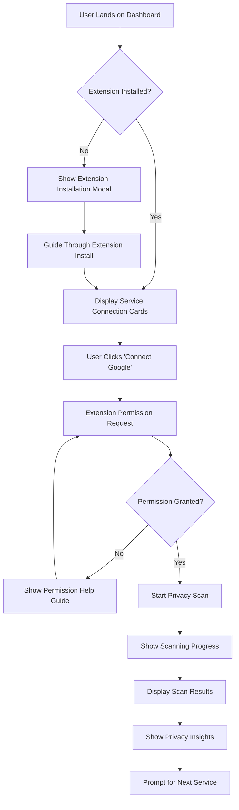
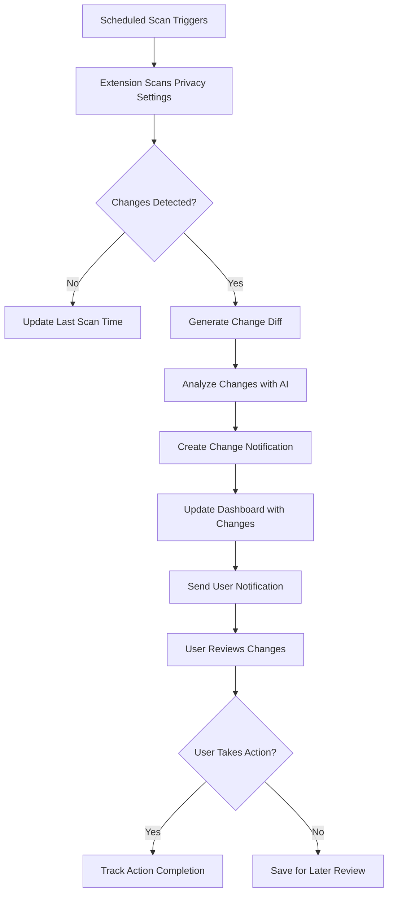

# 🎨 loopwho - UI/UX Design Document

## Design Overview

**Design Philosophy**: Clean, trustworthy, and accessible privacy-focused interface  
**Design System**: Built on shadCN UI components and MkSaaS foundation  
**Target Experience**: Professional yet approachable privacy dashboard  
**Accessibility**: WCAG 2.1 AA compliance with screen reader support  

## 1. Design Principles

### 1.1 Core Design Values
- **Transparency**: Visual clarity in privacy data presentation
- **Trust**: Professional design that instills confidence in security
- **Simplicity**: Complex privacy concepts made visually digestible
- **Accessibility**: Inclusive design for all users and abilities
- **Responsiveness**: Seamless experience across all devices

### 1.2 Visual Design Language
- **Color Palette**: Trust-focused blues with privacy-themed greens
- **Typography**: Clean, readable fonts optimized for data display
- **Iconography**: Consistent privacy and security-themed icons
- **Spacing**: Generous whitespace for reduced cognitive load
- **Animations**: Subtle, purposeful transitions that guide attention

## 2. User Experience Strategy

### 2.1 User Journey Mapping

#### New User Journey (First-Time Experience)
```
Landing Page → Sign Up → Email Verification → Extension Installation → 
Service Connection → First Scan → Dashboard Onboarding → Privacy Insights
```

#### Returning User Journey (Regular Usage)
```
Login → Dashboard Overview → Service Status Check → 
New Changes Review → Action on Recommendations → Settings Management
```

#### Power User Journey (Advanced Features)
```
Dashboard → Historical Analysis → Multi-Platform Comparison → 
Custom Alerts Setup → Privacy Score Tracking → Export Data
```

### 2.2 User Flow Diagrams

#### Primary User Flow: First Service Connection


#### Secondary User Flow: Privacy Change Detection


## 3. Information Architecture

### 3.1 Site Map
```
loopwho/
├── Landing Page
├── Authentication
│   ├── Sign Up
│   ├── Login
│   ├── Email Verification
│   └── Password Reset
├── Dashboard (Protected)
│   ├── Overview
│   ├── Service Cards
│   ├── Recent Changes
│   └── Privacy Insights
├── Settings
│   ├── Profile Management
│   ├── Connected Services
│   ├── Notification Preferences
│   └── Security Settings
├── History
│   ├── Change Timeline
│   ├── Privacy Snapshots
│   └── Data Export
└── Help & Support
    ├── Getting Started
    ├── Extension Guide
    ├── Privacy FAQ
    └── Contact Support
```

### 3.2 Navigation Structure

#### Primary Navigation (Header)
- Logo/Brand → Dashboard
- Dashboard → Main privacy overview
- History → Privacy change timeline
- Settings → User preferences and connected services
- Help → Support and documentation
- User Avatar → Profile dropdown menu

#### Secondary Navigation (Sidebar - Desktop)
- Quick Stats → Privacy score and summary
- Recent Changes → Latest privacy modifications
- Service Status → Connection health indicators
- Recommendations → AI-suggested actions

## 4. Page-by-Page Design Specifications

### 4.1 Landing Page

#### Layout Structure
- **Hero Section**: Value proposition with clear CTA
- **Feature Highlights**: Three-column feature showcase
- **How It Works**: Step-by-step process illustration
- **Social Proof**: User testimonials and security badges
- **Call to Action**: Prominent sign-up button

#### Key Components
- **Hero Banner**: Large heading, subtext, and primary CTA
- **Feature Cards**: Icon, title, description format
- **Process Steps**: Numbered visual workflow
- **Trust Indicators**: Security certifications and user count

#### Responsive Behavior
- Mobile: Single-column layout with stacked sections
- Tablet: Two-column feature grid
- Desktop: Full three-column layout with side navigation

### 4.2 Authentication Pages

#### Sign Up Page
- **Form Layout**: Centered card design (400px max width)
- **Input Fields**: Email, password with strength indicator
- **OAuth Options**: Google and GitHub social login buttons
- **Progressive Disclosure**: Terms acceptance and newsletter opt-in
- **Visual Feedback**: Real-time validation with clear error messages

#### Login Page
- **Simplified Form**: Email/password with "Remember me" option
- **Password Recovery**: Prominent "Forgot password?" link
- **Social Login**: Same OAuth options as sign-up
- **Accessibility**: Proper focus management and keyboard navigation

### 4.3 Main Dashboard

#### Layout Grid System
```
┌─────────────────────────────────────────────────┐
│ Header Navigation                                │
├─────────────────────────────────────────────────┤
│ ┌─────────────┐ ┌─────────────────────────────┐ │
│ │             │ │                             │ │
│ │   Sidebar   │ │        Main Content         │ │
│ │   (Desktop  │ │                             │ │
│ │    Only)    │ │  ┌─────────┐ ┌─────────┐   │ │
│ │             │ │  │Service  │ │Service  │   │ │
│ │             │ │  │Card 1   │ │Card 2   │   │ │
│ │             │ │  └─────────┘ └─────────┘   │ │
│ │             │ │                             │ │
│ │             │ │  ┌─────────┐ ┌─────────┐   │ │
│ │             │ │  │Service  │ │Add New  │   │ │
│ │             │ │  │Card 3   │ │Service  │   │ │
│ │             │ │  └─────────┘ └─────────┘   │ │
│ └─────────────┘ └─────────────────────────────┘ │
└─────────────────────────────────────────────────┘
```

#### Service Connection Cards
- **Card Structure**: 
  - Header: Platform logo + name + connection status
  - Body: Last scan time + privacy score + change indicators
  - Footer: Action buttons (Scan Now, View Details, Settings)
- **Status Indicators**: 
  - Connected (Green): Active and scanning
  - Disconnected (Red): Requires reconnection
  - Scanning (Blue): Currently in progress
  - Error (Orange): Scan failed, needs attention

#### Empty State Design
- **First-Time Users**: 
  - Large illustration of privacy dashboard concept
  - Clear heading: "Connect Your First Service"
  - Step-by-step instructions with visual cues
  - Prominent "Install Extension" button if not installed

### 4.4 Privacy Settings Detail View

#### Information Hierarchy
```
Service Name (Google Privacy Settings)
├── Connection Status & Last Scan
├── Privacy Score & Overall Assessment
├── Settings Categories (Expandable Accordions)
│   ├── Advertising & Personalization
│   │   ├── Ad Personalization (Toggle State + Explanation)
│   │   ├── Activity Tracking (Toggle State + Explanation)
│   │   └── Data Sharing (Toggle State + Explanation)
│   ├── Location & Activity
│   │   ├── Location History (Toggle State + Explanation)
│   │   ├── Web Activity (Toggle State + Explanation)
│   │   └── YouTube History (Toggle State + Explanation)
│   └── Data & Privacy
│       ├── Data Download (Link + Status)
│       ├── Account Deletion (Link + Status)
│       └── Privacy Checkup (Link + Last Completed)
└── Recent Changes Timeline
```

#### Visual Design Elements
- **Privacy Score**: Circular progress indicator (0-100 scale)
- **Setting Toggles**: Visual representation of current state (On/Off)
- **Change Indicators**: Colored badges showing recent modifications
- **Risk Levels**: Color-coded system (Green/Yellow/Red) for privacy impact
- **Action Buttons**: Direct links to platform settings with external link icons

### 4.5 Change History & Timeline

#### Timeline Layout
- **Chronological Order**: Most recent changes at top
- **Grouping**: Changes grouped by date with expandable sections
- **Change Cards**: Each modification shown as individual card
- **Filtering**: Dropdown to filter by platform, change type, or date range

#### Change Visualization
- **Before/After Comparison**: Side-by-side view of setting changes
- **Diff Highlighting**: Clear visual indicators of what changed
- **Impact Assessment**: AI-generated explanation of change implications
- **Action Tracking**: Record if user took action based on change

## 5. Component Library & Design System

### 5.1 Core Components (Built on shadCN UI)

#### Buttons
- **Primary**: Main actions (Connect Service, Save Settings)
- **Secondary**: Secondary actions (Cancel, View Details)
- **Destructive**: Dangerous actions (Disconnect Service, Delete Account)
- **Ghost**: Subtle actions (Help, Learn More)
- **Icon**: Action buttons with icons only

#### Cards
- **Service Card**: Platform connection status and quick actions
- **Insight Card**: Privacy recommendations and tips
- **Change Card**: Historical privacy setting modifications
- **Stat Card**: Key metrics and privacy scores

#### Form Elements
- **Input Fields**: Text, email, password with validation states
- **Toggles**: Privacy setting on/off switches
- **Select Dropdowns**: Platform selection, time ranges
- **Checkboxes**: Multi-select options for notifications
- **Radio Buttons**: Single-select options for preferences

#### Navigation
- **Header Navigation**: Primary site navigation with user menu
- **Sidebar Navigation**: Secondary navigation for dashboard sections
- **Breadcrumbs**: Page hierarchy for deep navigation
- **Pagination**: Large dataset navigation for history views

#### Feedback Elements
- **Alerts**: Success, error, warning, and info messages
- **Toast Notifications**: Temporary feedback for user actions
- **Loading Spinners**: Progress indicators for async operations
- **Progress Bars**: Scan progress and completion status

### 5.2 Custom Privacy-Specific Components

#### Privacy Score Indicator
- **Visual**: Circular progress ring with percentage
- **Color Coding**: Green (80-100), Yellow (50-79), Red (0-49)
- **Breakdown**: Expandable detail showing score factors
- **Trend**: Small arrow indicating score improvement/decline

#### Service Status Badge
- **Connected**: Green checkmark with "Active" text
- **Disconnected**: Red X with "Reconnect" action
- **Scanning**: Blue spinner with "Scanning..." text
- **Error**: Orange warning with "Needs Attention" text

#### Change Diff Viewer
- **Side-by-Side**: Before and after states clearly labeled
- **Inline Highlighting**: Changed elements highlighted in context
- **Summary**: Brief explanation of what changed and why it matters
- **Actions**: Quick links to review or modify the setting

#### Privacy Recommendation Card
- **Priority Indicator**: High/Medium/Low priority badge
- **Recommendation Text**: Clear, actionable suggestion
- **Impact Assessment**: Expected privacy improvement
- **Action Button**: Direct link to implement recommendation

## 6. Responsive Design Strategy

### 6.1 Breakpoint System
- **Mobile**: 320px - 767px (Single column, touch-optimized)
- **Tablet**: 768px - 1023px (Two columns, mixed interaction)
- **Desktop**: 1024px+ (Multi-column, mouse/keyboard optimized)

### 6.2 Mobile-First Adaptations

#### Navigation
- **Mobile**: Hamburger menu with slide-out navigation
- **Tablet**: Condensed horizontal navigation with dropdowns
- **Desktop**: Full horizontal navigation with sidebar

#### Dashboard Layout
- **Mobile**: Single-column service cards, full-width
- **Tablet**: Two-column grid with responsive card sizing
- **Desktop**: Three-column grid with sidebar for quick actions

#### Data Tables
- **Mobile**: Card-based layout with stacked information
- **Tablet**: Horizontal scroll for full table view
- **Desktop**: Full table with all columns visible

## 7. Accessibility & Usability

### 7.1 Accessibility Features
- **Keyboard Navigation**: Full keyboard accessibility with logical tab order
- **Screen Reader Support**: Proper ARIA labels and semantic HTML
- **Color Contrast**: WCAG AA compliant color combinations
- **Focus Indicators**: Clear visual focus states for all interactive elements
- **Alternative Text**: Descriptive alt text for all images and icons

### 7.2 Usability Enhancements
- **Progressive Disclosure**: Complex information revealed progressively
- **Contextual Help**: Tooltips and help text for complex concepts
- **Error Prevention**: Input validation and confirmation dialogs
- **Undo Actions**: Ability to reverse destructive actions
- **Consistent Patterns**: Uniform interaction patterns throughout app

### 7.3 Performance Considerations
- **Lazy Loading**: Images and non-critical content loaded on demand
- **Skeleton Screens**: Loading placeholders for better perceived performance
- **Optimized Images**: Responsive images with appropriate formats
- **Minimal JavaScript**: Progressive enhancement with core functionality first

## 8. Visual Design Specifications

### 8.1 Color Palette

#### Primary Colors
- **Primary Blue**: #2563eb (Trust, security, primary actions)
- **Primary Green**: #059669 (Privacy, security, positive states)
- **Neutral Gray**: #6b7280 (Text, borders, secondary elements)

#### Semantic Colors
- **Success Green**: #10b981 (Successful scans, good privacy scores)
- **Warning Orange**: #f59e0b (Attention needed, medium risk)
- **Error Red**: #ef4444 (Failed scans, high privacy risks)
- **Info Blue**: #3b82f6 (Informational messages, neutral states)

#### Background Colors
- **Light Mode**: 
  - Primary: #ffffff (Main background)
  - Secondary: #f9fafb (Card backgrounds)
  - Tertiary: #f3f4f6 (Section dividers)
- **Dark Mode**:
  - Primary: #111827 (Main background)
  - Secondary: #1f2937 (Card backgrounds)
  - Tertiary: #374151 (Section dividers)

### 8.2 Typography Scale
- **Heading 1**: 36px/44px, font-weight: 700 (Page titles)
- **Heading 2**: 30px/36px, font-weight: 600 (Section headers)
- **Heading 3**: 24px/32px, font-weight: 600 (Card titles)
- **Heading 4**: 20px/28px, font-weight: 500 (Subsection headers)
- **Body Large**: 18px/28px, font-weight: 400 (Important body text)
- **Body**: 16px/24px, font-weight: 400 (Standard body text)
- **Body Small**: 14px/20px, font-weight: 400 (Secondary text)
- **Caption**: 12px/16px, font-weight: 400 (Metadata, timestamps)

### 8.3 Spacing System
- **Base Unit**: 4px
- **Spacing Scale**: 4px, 8px, 12px, 16px, 24px, 32px, 48px, 64px, 96px
- **Component Padding**: 16px (Mobile), 24px (Tablet+)
- **Section Margins**: 32px (Mobile), 48px (Tablet+)
- **Page Margins**: 16px (Mobile), 24px (Tablet), 32px (Desktop)

### 8.4 Border Radius & Shadows
- **Border Radius**: 8px (Cards), 4px (Buttons), 6px (Form elements)
- **Box Shadows**:
  - Subtle: 0 1px 3px rgba(0,0,0,0.1)
  - Medium: 0 4px 6px rgba(0,0,0,0.1)
  - Large: 0 10px 15px rgba(0,0,0,0.1)

## 9. Animation & Interaction Design

### 9.1 Animation Principles
- **Purposeful**: Animations guide attention and provide feedback
- **Fast**: Duration between 200-300ms for most transitions
- **Easing**: Use ease-out for entering, ease-in for exiting
- **Respectful**: Honor prefers-reduced-motion accessibility setting

### 9.2 Micro-Interactions
- **Button Hover**: Subtle color change and elevation
- **Card Hover**: Slight elevation increase and border color change
- **Form Focus**: Border color change and subtle glow effect
- **Loading States**: Skeleton screens and progress indicators
- **Success Actions**: Brief checkmark animation and color flash

### 9.3 Page Transitions
- **Route Changes**: Subtle fade transition between pages
- **Modal Animations**: Scale and fade in/out with backdrop
- **Sidebar Toggle**: Smooth slide animation for mobile menu
- **Accordion Expand**: Smooth height animation with easing

## 10. Prototyping & Testing Plan

### 10.1 Prototyping Approach
- **Low-Fidelity**: Wireframes for initial layout validation
- **High-Fidelity**: Interactive prototypes for user testing
- **Responsive**: Test designs across all target breakpoints
- **Accessibility**: Validate with screen readers and keyboard navigation

### 10.2 User Testing Strategy
- **Moderated Sessions**: 8-10 users for initial concept validation
- **Unmoderated Testing**: A/B tests for specific design decisions
- **Accessibility Testing**: Dedicated sessions with assistive technology users
- **Performance Testing**: Real-world device and connection testing

### 10.3 Design Validation Metrics
- **Task Completion Rate**: 90%+ for core user flows
- **Time to Complete**: < 2 minutes for service connection
- **User Satisfaction**: 4.5+ rating on design and usability
- **Accessibility Score**: WCAG AA compliance verification

This comprehensive UI/UX design document ensures a user-centered, accessible, and visually appealing privacy dashboard that builds trust while making complex privacy concepts understandable and actionable.
